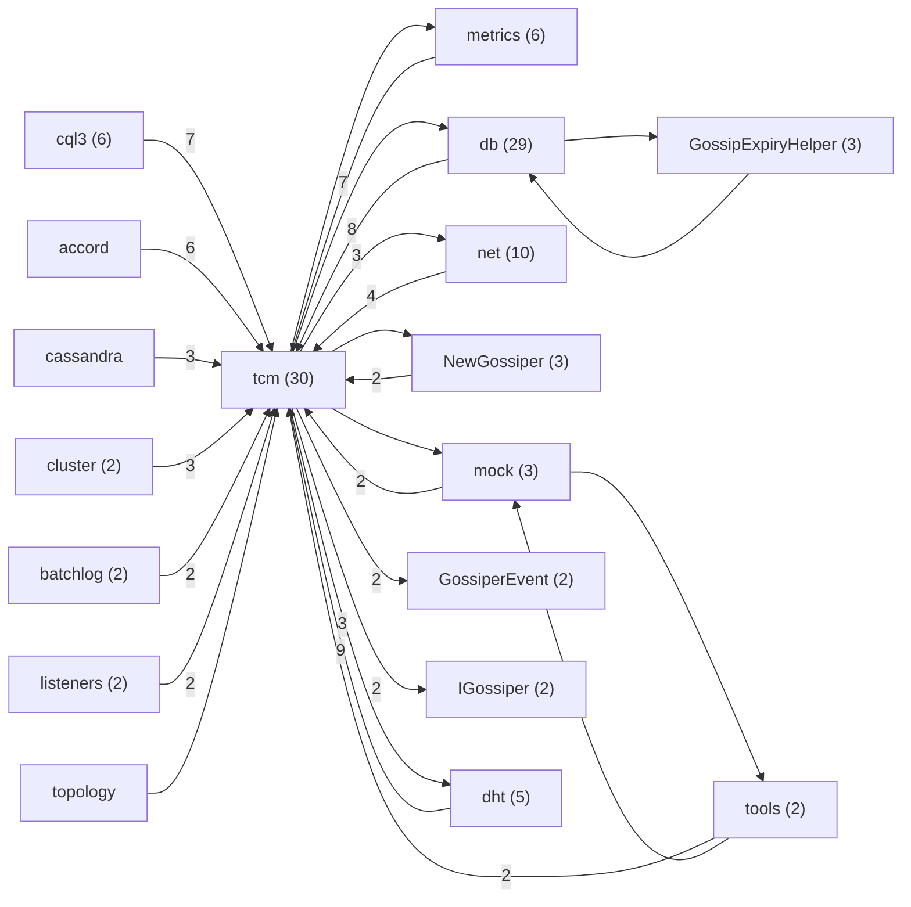
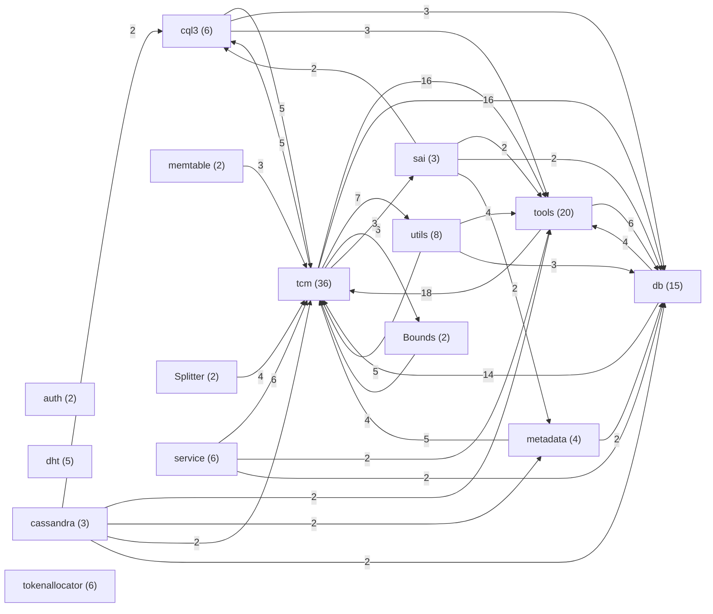

# Cassandra Architecture Analysis

Design Structure Matrix (DSM) analysis of Apache Cassandra using `frg dsm`.
Cassandra is a distributed wide-column database built on Java, implementing
Dynamo-style consistent hashing with Paxos-based consensus and gossip membership.

## Analysis Scope

| Component | Path | Classes | Language |
|-----------|------|---------|----------|
| Gossip (gms) | `o.a.c.gms` | 110 | Java |
| DHT (dht) | `o.a.c.dht` | 178 | Java |
| Full project | `/tmp/cassandra` | 3,159 | Java |

Cassandra's full codebase (3,159 Java files) is too large for class-level DSM
in a single pass. We analyze two key subsystems that are architecturally
comparable to Riak's `riak_core`: the gossip/failure-detection layer (gms)
and the distributed hash table layer (dht).

---

## Gossip / Failure Detection (gms)

### Summary Metrics

| Metric | Value | Status |
|--------|-------|--------|
| Elements | 110 | - |
| Dependencies | 234 | - |
| Propagation Cost | 2.8% | good |
| Max Cycle Size | 0 | good |
| Number of Cycles | 0 | - |
| Cluster Quality | 67.5% | warning |

**Propagation cost of 2.8%** means a change to one class affects ~3 of 110
classes on average. Zero dependency cycles — a clean, layered design.

### Dependency Graph (Collapsed)

Auto-generated collapsed view — 110 classes across 18 clusters.

Key cluster: **c14** (30 classes) is the core gossip hub containing `Gossiper`,
`EndpointState`, `FailureDetector`, `ApplicationState`, `VersionedValue`, plus
service/locator/TCM integration. All other clusters flow inward to c14.

### God Classes

| Class | Fan-in | Role |
|-------|--------|------|
| `Gossiper` | 38 | Central gossip coordinator |
| `ApplicationState` | 26 | Enum of node state keys |
| `EndpointState` | 23 | Per-node state container |
| `VersionedValue` | 22 | Versioned state values |
| `FailureDetector` | 21 | Phi-accrual failure detection |
| `IEndpointStateChangeSubscriber` | 11 | Observer interface |

### Cycle Analysis

**Zero cycles** — Cassandra's gossip layer uses interfaces (`IFailureDetector`,
`IEndpointStateChangeSubscriber`, `IGossiper`) to break what would otherwise
be circular dependencies. This is a stark contrast to Riak's `riak_core` where
the gossip/ring/vnode layers form a 45-module mega-cycle.

---

## Distributed Hash Table (dht)

### Summary Metrics

| Metric | Value | Status |
|--------|-------|--------|
| Elements | 178 | - |
| Dependencies | 509 | - |
| Propagation Cost | 2.2% | good |
| Max Cycle Size | 0 | good |
| Number of Cycles | 0 | - |
| Cluster Quality | 30.8% | critical |

### Dependency Graph (Collapsed)

Auto-generated collapsed view — 178 classes across 58 clusters.

> Smaller singleton clusters omitted for clarity.

### God Classes

| Class | Fan-in | Role |
|-------|--------|------|
| `Token` | 78 | Abstract token in the ring |
| `Murmur3Partitioner` | 77 | Default partitioner |
| `IPartitioner` | 61 | Partitioner interface |
| `Range` | 55 | Token range abstraction |
| `AbstractBounds` | 36 | Bounds base class |
| `ByteOrderedPartitioner` | 29 | Ordered partitioner |

### Cycle Analysis

**Zero cycles.** The `IPartitioner` interface cleanly separates partitioner
implementations from consumers. `Token` and `Range` are pure data types with
no back-references to the service layer.

---

## Dead Code Analysis

| Metric | Value |
|--------|-------|
| Total declarations | 113,761 |
| Entry points | 33,404 |
| Reachable symbols | 20,280 |
| Definitely dead | 48,756 (42.9%) |
| Possibly dead | 14,410 (12.7%) |

The high "definitely dead" count (42.9%) reflects limitations of static analysis
on Java frameworks:

1. **Reflection-heavy patterns**: Cassandra uses reflection for serialization,
   MBeans, and plugin loading — these references are invisible to import scanning
2. **Annotation-driven entry points**: `@Override`, `@Test`, Spring annotations
   are detected, but custom annotations and JMX registration are not
3. **Cross-module calls**: Inner classes referenced as `Outer.Inner` may not
   match the declaration `Outer$Inner`

The dead code numbers should be interpreted as an upper bound. A more accurate
analysis would require bytecode-level reference extraction (e.g., via jdeps on
compiled JARs).

---

## Comparison: Cassandra vs Riak

| Metric | Cassandra gms | Cassandra dht | Riak riak_core | Riak riak_kv |
|--------|--------------|---------------|----------------|--------------|
| Elements | 110 | 178 | 124 | 167 |
| Dependencies | 234 | 509 | 443 | 574 |
| Propagation Cost | 2.8% | 2.2% | 34.6% | 32.8% |
| Max Cycle Size | 0 | 0 | 45 (36%) | 49 (29%) |
| Cluster Quality | 67.5% | 30.8% | 54.4% | 33.6% |

### Key Architectural Differences

**1. Interface-driven decoupling (Cassandra) vs. direct coupling (Riak)**

Cassandra uses Java interfaces (`IPartitioner`, `IFailureDetector`,
`IEndpointStateChangeSubscriber`) to establish clean dependency boundaries.
Riak's Erlang modules call each other directly via `module:function()`, creating
tight coupling — particularly between `riak_core_ring`, `riak_core_vnode`,
and `riak_core_gossip`.

**2. Zero cycles vs. mega-cycles**

Cassandra achieves zero dependency cycles in both analyzed subsystems.
Riak has 36-45% of its modules trapped in single mega-cycles. This is partly
a language difference (Java's type system encourages interface extraction)
and partly an architectural choice.

**3. Propagation cost: 2-3% vs. 33-35%**

A change to one Cassandra gossip class affects ~3 others on average.
A change to one Riak core module affects ~43 others. This 10x difference
directly impacts development velocity and risk of regressions.

**4. Similar cluster quality in KV layers**

Both `riak_kv` (33.6%) and Cassandra's `dht` (30.8%) show critical cluster
quality — suggesting that the storage/query integration layer tends toward
flat, interconnected architecture regardless of language.

---

*Generated by `frg dsm` — Java import-based dependency extraction with
Tarjan SCC detection, Thebeau clustering, and BFS dead-code analysis.*
