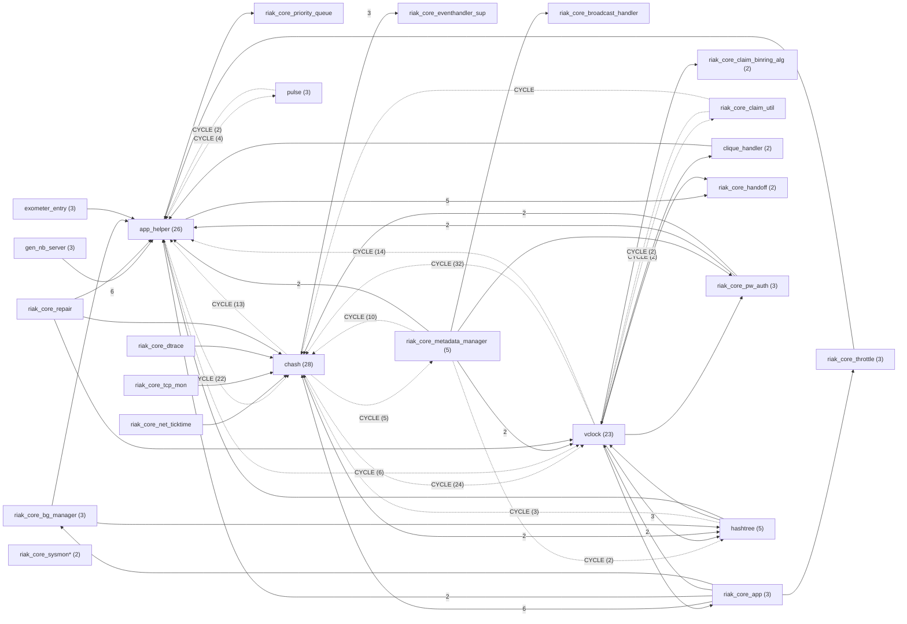
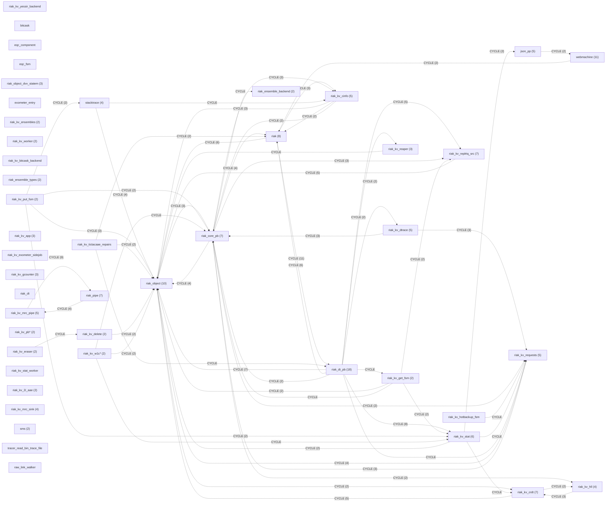

# Riak Architecture Analysis

Design Structure Matrix (DSM) analysis of Riak's core components using `frg dsm`.
Riak is a distributed key-value database built on Erlang/OTP, implementing
Amazon Dynamo-style consistent hashing, vnodes, and eventually-consistent replication.

## Analysis Scope

| Component | Path | Modules | Dependencies | Language |
|-----------|------|---------|--------------|----------|
| riak_core | `/tmp/riak_core` | 124 | 443 | Erlang |
| riak_kv | `/tmp/riak_kv` | 167 | 574 | Erlang |

---

## riak_core

### Summary Metrics

| Metric | Value | Status |
|--------|-------|--------|
| Elements | 124 | - |
| Dependencies | 443 | - |
| Propagation Cost | 34.6% | critical |
| Max Cycle Size | 45 | critical |
| Number of Cycles | 1 | - |
| Cluster Quality | 54.4% | warning |

**Propagation cost of 34.6%** means that on average, a change to one module
may propagate to ~43 of the 124 modules. The single 45-module cycle is the
primary contributor — over a third of all modules are mutually dependent.

### Dependency Graph (Collapsed)

Auto-generated collapsed view — each node represents a cluster of related modules.
Edge labels show the number of inter-cluster dependencies; dashed edges indicate
cycle participation. 124 modules across 24 clusters.



Key clusters: **c17** = chash/ring/capability/gossip/metadata (28 modules),
**c15** = vclock/claimant/membership/ring (23 modules),
**c10** = app_helper/vnode/handoff/stat (26 modules).
The heaviest cycle edges (32, 24, 22 deps) flow between these three clusters.

### Cycle Analysis

**1 cycle involving 45 modules (36% of codebase):**

The mega-cycle spans ring management, vnode layer, cluster membership, handoff,
metadata, and stats — effectively the entire core. Key cycle drivers:

| Module | Fan-in | Fan-out | Role in Cycle |
|--------|--------|---------|---------------|
| `riak_core_ring` | high | high | Central data structure, referenced by nearly everything |
| `riak_core_vnode` | high | high | Generic vnode behavior, couples to ring + handoff |
| `riak_core_util` | high | medium | Utility grab-bag, pulls in ring for convenience |
| `riak_core_gossip` | medium | high | Cluster coordination, touches ring + membership |
| `riak_core_claimant` | medium | high | Partition assignment, couples ring + membership |

**Root cause**: `riak_core_ring` is both a data structure and a coordination point.
Modules that should only read ring state also depend on modules that write to it,
creating circular paths through the ring manager, gossip, and claimant.

---

## riak_kv

### Summary Metrics

| Metric | Value | Status |
|--------|-------|--------|
| Elements | 167 | - |
| Dependencies | 574 | - |
| Propagation Cost | 32.8% | critical |
| Max Cycle Size | 49 | critical |
| Number of Cycles | 2 | - |
| Cluster Quality | 33.6% | critical |

### Dependency Graph (Collapsed)

Auto-generated collapsed view — 167 modules across 46 clusters.
Edge labels show inter-cluster dependency counts; dashed edges indicate cycles.



Key clusters: **c0** = riak_object/backends/util (10 modules),
**c8** = riak_dt_pb/client/replrtq_snk/ttaaefs (18 modules),
**c13** = riak_core_pb/vnode/kv_vnode (7 modules),
**c28** = riak/index/exchange_fsm/reader (8 modules).
The heaviest cycle edges (11, 9, 8 deps) flow between c28↔c8, c26↔c42 (MapReduce), and c8↔c34 (stats).

### Cycle Analysis

**Cycle 1: 49 modules (29% of codebase)**

The primary cycle spans the vnode, FSMs, AAE, replication, and stats layers.
Key coupling points:

- `riak_kv_vnode` depends on `riak_kv_stat` (for instrumentation)
  which depends on `riak_kv_status` which depends on `riak_kv_vnode`
- `riak_kv_util` is a utility module referenced by almost everything,
  but it also reads from the vnode layer
- `riak_object` is coupled to `riak_kv_crdt` which is coupled to `riak_kv_vnode`

**Cycle 2: 6 modules (MapReduce pipeline)**

```
riak_kv_mrc_map <-> riak_kv_mrc_pipe <-> riak_kv_pipe_get
riak_kv_mrc_pipe <-> riak_kv_w_reduce
riak_kv_mrc_pipe <-> riak_kv_pipe_index
riak_kv_mrc_pipe <-> riak_kv_pipe_listkeys
```

This is a tighter, more contained cycle within the MapReduce subsystem.

---

## Dead Code Analysis

### riak_core

| Metric | Value |
|--------|-------|
| Total declarations | 3,955 |
| Entry points | 226 |
| Reachable symbols | 3,668 |
| Definitely dead | 67 (1.7%) |
| Possibly dead | 184 (4.7%) |

**Definite dead code by module:**

| Module | Dead Functions | Description |
|--------|---------------|-------------|
| `riak_core_handoff_status` | 25 | Entire module appears dead — no exported functions are called. Likely replaced by CLI-based handoff reporting. |
| `bg_manager_tests` | 16 | Test helper functions not invoked by EUnit generators. May use EUnit macros not detected by static analysis. |
| `riak_core_repair` | 2 | `make_nowrap/4`, `make_wrap/4` — private repair functions not called anywhere. |
| `riak_core_stat_xform` | 1 | `transform/1` — exometer stat transform callback, possibly registered dynamically. |
| `riak_core_security_tests` | 1 | `start_manager/0` — test setup function. |

**Note:** The 184 "possibly dead" items are public functions not referenced
internally. Many are likely used by dependent applications (riak_kv, riak_pipe, etc.)
via remote calls `riak_core_*:function()`.

### riak_kv

| Metric | Value |
|--------|-------|
| Total declarations | 4,785 |
| Entry points | 136 |
| Reachable symbols | 4,514 |
| Definitely dead | 0 |
| Possibly dead | 195 (4.1%) |

No definitely dead code in riak_kv — all private functions are reachable.
The 195 possibly dead items are public functions not referenced internally,
likely used by HTTP/PB API handlers, riak_pipe, or other OTP applications.

---

## Combined Architecture Observations

### 1. God Module Anti-Pattern

Both `riak_core_ring` and `riak_kv_vnode` exhibit god-module characteristics:
- High fan-in (many modules depend on them)
- High fan-out (they depend on many modules)
- They are the primary drivers of the mega-cycles

### 2. Utility Module Coupling

`riak_core_util` and `riak_kv_util` create unnecessary coupling by mixing
unrelated utilities that pull in heavy dependencies. Splitting these into
focused modules would reduce propagation cost.

### 3. Stats/Instrumentation Cycles

In both components, stats modules create cycles by importing the modules
they instrument. Using a callback/event pattern instead would break these cycles.

### 4. Cluster Quality

| Component | Cluster Quality | Assessment |
|-----------|----------------|------------|
| riak_core | 54.4% | Warning — moderate modularity |
| riak_kv | 33.6% | Critical — poor module boundaries |

riak_kv's lower cluster quality reflects its flatter architecture where
most modules can reach most other modules within 2-3 hops.

### 5. Comparison to Other Distributed Databases

| Metric | riak_core | riak_kv | Typical Threshold |
|--------|-----------|---------|-------------------|
| Propagation Cost | 34.6% | 32.8% | < 20% good, < 30% acceptable |
| Max Cycle Size | 45 (36%) | 49 (29%) | < 10% of modules |
| Cluster Quality | 54.4% | 33.6% | > 70% good |

Both components exceed typical thresholds. The large cycles are characteristic
of organically-grown distributed systems where cross-cutting concerns
(ring, gossip, stats) were added incrementally rather than designed as
isolated layers.

---

*Generated by `frg dsm` — Erlang/OTP dependency extraction with
Tarjan SCC detection, Thebeau clustering, and BFS dead-code analysis.*
