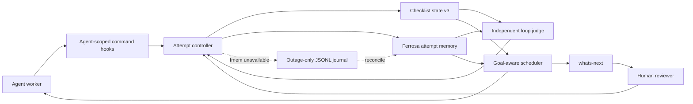
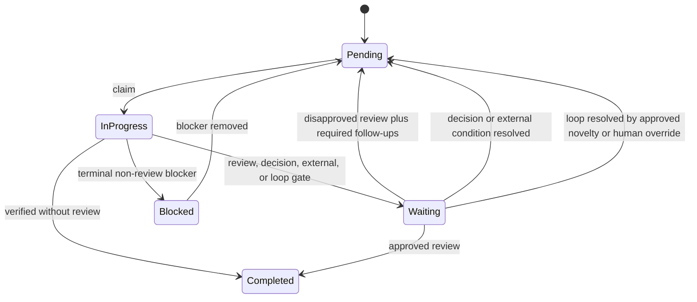

# Forge Anti-Loop Attempt Control

> Last updated: 2026-07-12
> Status: review
> Scope: `tools/forge`, Ferrosa/fmem integration, `continue-until-done`, `tdd`, and `whats-next`

## Purpose

Forge must prevent agents from spending repeated turns on substantially the
same low-progress attempt while preserving legitimate verification, transient
retries, critical work, and human control. The scheduler optimizes progress
toward the larger goal rather than persistence on the currently focused item.

The design uses two guards:

1. A deterministic fingerprint catches exact unchanged attempts.
2. An independent model judges semantically similar low-progress attempts in
   the context of the item, its parent goal, and alternative ready work.

## Current implementation evidence

- `forge-checklist-state` currently supports `pending`, `in_progress`,
  `completed`, and `blocked` item states.
- Checklist schema v2 has dependency metadata, ready calculation, claims, and
  leases, but no typed gate, review record, attempt model, goal reference, or
  priority score.
- Notes are one free-text string and cannot safely drive state transitions.
- CLI and MCP handlers are concentrated in `crates/cli/src/main.rs`, the primary
  Forge churn and bug-fix hotspot. New behavior should remain in
  `forge-checklist-state` and small dedicated crates rather than expanding
  handler logic inline.
- Existing hooks provide best-effort hints after failures. They do not issue
  attempt tokens or enforce loop policy.

## Goals

- Record only meaningful attempt events: `red`, `green`, `verification`,
  `blocker`, and `review_ready`.
- Detect exact and nearly identical low-progress loops.
- Require a structurally novel next action, a pivot, or human input.
- Rank work using importance, ease, dependency-unlock value, goal progress,
  retry penalties, and human preference.
- Keep critical waiting items visible and ask the user for the missing input.
- Preserve a complete explanation of reviews, overrides, loop findings, and
  priority changes.
- Fail open when independent judging or Ferrosa is unavailable while retaining
  deterministic checklist-local protection.

## Non-goals

- Persisting raw terminal output or unredacted shell streams.
- Capturing ordinary status reads, pane captures, or process polling as
  attempts.
- Automatically splitting work items; agents retain that semantic task.
- Blocking human terminal commands.
- Replacing checklist state with semantic memory.

## Component architecture



Component boundaries:

- `forge-checklist-state`: schema, atomic transitions, gates, reviews, exact
  repeat state, goal links, and score inputs.
- Attempt controller: start/finish tokens, normalization, progress deltas,
  novelty declarations, and hook contract.
- Loop judge: retrieval, independent-model classification, confidence policy,
  and required pivot.
- Scheduler: score calculation, decay, unlock bonuses, advisory ordering, and
  automatic claim policy.
- Ferrosa adapter: meaningful event ingestion, similarity retrieval, folding,
  retention, and fallback reconciliation.

## Checklist schema v3

All additions are optional with Serde defaults so schema v1 and v2 checklists
remain readable.

### Item status and waiting gates

Add `waiting` to `ItemStatus` and a typed gate:

```json
{
  "status": "waiting",
  "gate": {
    "kind": "decision",
    "createdAt": "2026-07-12T18:00:00Z",
    "reason": "Canonical span ownership requires user preference",
    "question": "Use boundary-local or remote endpoints?",
    "attemptIds": ["A-17", "A-18"],
    "artifactRefs": ["specs/proposal.md#ties"]
  }
}
```

`GateKind` is closed to:

- `review`
- `decision`
- `external`
- `loop_detected`

Entering `waiting` releases the active lease. Waiting dependencies are not
complete and do not make dependents ready.

### Review record

Review is a record, not an item status:

```json
{
  "review": {
    "outcome": "approved",
    "reviewerId": "human:bkearns",
    "reviewedAt": "2026-07-12T18:05:00Z",
    "reason": "Boundary-local lifecycle approved",
    "feedback": [],
    "followUpItemIds": ["T-44"]
  }
}
```

Review processing is one atomic checklist mutation:

- `approved` completes the original item and may create linked `optional` or
  `informational` follow-ups.
- `disapproved` returns the original item to `pending`, creates linked
  `required` follow-ups, and makes those follow-ups dependencies of the
  original.
- Every feedback item records its source review and severity.

### Goal and priority fields

New loop-managed items should declare:

```json
{
  "goalRef": "G-jsm-parity",
  "goalSummary": "Complete all 335 engraving cases",
  "itemContribution": "Prove one strict cross-measure tie case",
  "basePriority": 80,
  "effort": "small",
  "critical": false,
  "humanPriorityOverride": null,
  "parentItemId": null
}
```

Goal references remain optional for legacy checklists. They are required for
new checklists that opt into automatic anti-loop scheduling.

### Operational attempt state

Checklist JSON retains only bounded operational data:

```json
{
  "attemptState": {
    "lastFingerprint": "sha256:...",
    "sameAttemptCount": 1,
    "similarLowProgressCount": 0,
    "lastEventRefs": ["fmem:..."],
    "retryPenalty": 0,
    "goalRetryPenalty": 0,
    "lastProgressAt": "2026-07-12T18:00:00Z"
  }
}
```

Full normalized event history lives in Ferrosa. Checklist state remains usable
without it.

## Meaningful attempt events

Ferrosa stores an event only for `red`, `green`, `verification`, `blocker`, or
`review_ready`. Each event contains:

- tool or command category;
- redacted normalized argv or a command hash;
- exit status;
- structured result signature;
- relevant path/input digest;
- agent, session, and attempt IDs;
- repository, goal, and item references;
- worker model/version and attempt role (`implementer` or `verifier`);
- timestamp and elapsed time;
- hypothesis, action, progress delta, new information, novelty declaration,
  and proposed next action.

Raw stdout, stderr, secrets, chain-of-thought, pane captures, and polling are
not persisted.

## Exact-repeat guard

The deterministic fingerprint covers:

```text
item ID
acceptance criterion
declared relevant path/input digests
normalized command
normalized result
dependency and gate state
```

The digest is scoped to declared relevant paths. Hashing the entire dirty
worktree would let unrelated edits masquerade as progress.

Policy:

1. The implementer may execute the attempt once.
2. One distinct verifier may repeat it exactly once.
3. A third unchanged attempt is rejected and activates
   `waiting/loop_detected`.
4. Transient operations may declare a higher bounded retry policy before the
   first attempt.
5. A rephrased prompt or a different model does not make the attempt novel.

## Semantic loop judge

The semantic guard detects near repeats across changed commands, files, items,
or prompts. It receives normalized attempt summaries, not raw transcripts, and
returns:

```text
productive | verification | productive_retry | loop | uncertain
```

The response includes confidence, cited attempt IDs, progress evidence, and a
required pivot or human question.

Judging policy:

- Medium confidence emits a warning and requires a novelty declaration.
- High confidence activates `waiting/loop_detected`.
- Two similar low-progress attempts also activate the gate even when each
  individual score is below the high-confidence threshold.
- A cheap model different from the worker judges first.
- `uncertain` escalates once to a stronger different model or reasoning level.
- If no independent model is available, semantic enforcement fails open;
  deterministic exact-repeat protection remains active.
- Numeric confidence thresholds are configuration, calibrated on fixtures
  before enforcement rather than embedded as unreviewed constants.

## Novelty and human escalation

After independent verification, the next implementation attempt must declare
at least one structural novelty:

- a new hypothesis;
- new input or evidence;
- a different code path or scope;
- a different diagnostic or tool;
- a different implementation strategy;
- a pivot to another ready item; or
- a specific question for human input.

Human input is preferred immediately for product, schema, policy, or preference
decisions. It is also valid after a loop finding or when no structurally novel
attempt exists. Asking the human creates `waiting/decision`; it is not a
failure.

## Priority scoring and decay

Forge exposes an explainable score:

```text
effective priority =
    base priority
  + ease bonus
  + dependency unlock bonus
  + goal progress bonus
  + human preference
  - exact retry penalty
  - semantic fixation penalty
  - parent goal retry penalty
```

Rules:

- High-priority, easy work scores well.
- Work that unlocks high-priority or several downstream items receives a bonus
  computed from the DAG and their estimated effort.
- Similar low-progress retries penalize the item immediately.
- A parent goal is penalized only after fixation crosses items or the agent
  repeatedly returns after a pivot; one stuck child does not penalize the goal.
- Retry and fixation penalties decay. Time gives modest recovery; changed
  evidence, changed dependencies, or human preference can restore priority
  fully.
- Critical/security/release-blocking items have a configured floor. They remain
  visible even when waiting and must request help rather than disappear.
- Later work that can unblock a penalized item or goal receives an unlock bonus.
- Human preference may set, clear, or replace priority and decay state, with an
  auditable reason.

Scores are advisory for ordinary `ready` and `whats-next` output. During an
explicit `continue-until-done` run, automatic claims enforce descending score so
the highest-value ready work is completed first. An agent cannot override that
order without human approval.

## `whats-next` behavior

`whats-next` returns two sections:

1. `Needs your help`: critical or high-priority waiting items, their question,
   gate kind, why the task matters, and what the answer would unblock.
2. `Recommended work`: scored ready items with concise score explanations.

A critical waiting item remains the top recommendation to the user even while
automatic work proceeds on the highest-scored ready item.

## CLI and MCP surface

Proposed CLI commands:

```text
frg checklist attempt-start <checklist> <item> --agent ... --role ... --event-kind ...
frg checklist attempt-finish <checklist> <item> <attempt> --result ... --progress ...
frg checklist wait <checklist> <item> --kind review|decision|external|loop_detected ...
frg checklist review <checklist> <item> --outcome approved|disapproved --file review.json
frg checklist resolve <checklist> <item> --by human:... --reason ...
frg checklist score <checklist>
frg checklist ready <checklist> --scored
```

Equivalent MCP modes use structured arguments and return structured state,
score components, prior attempt IDs, recovery hints, and Ferrosa event refs.

`attempt-start` issues a short-lived token bound to checklist, item, agent,
role, command fingerprint, and relevant input digest. `attempt-finish` consumes
it exactly once.

## Hooks and overrides

Hard enforcement applies only to agent-managed processes carrying a Forge run
identity. Human terminal commands are never blocked.

- A meaningful agent command requires a valid attempt token.
- Observation commands use a cheaper observation classification and do not
  count as attempts.
- Agents have no `--force` bypass.
- A human may override a loop or score decision with a recorded identity and
  reason.
- Every override is persisted as a meaningful event and linked to affected
  gates, attempts, and priority changes.
- Hook failures fail open during rollout and emit a structured diagnostic.

Rollout proceeds from advisory instrumentation, to automatic
`continue-until-done` scheduling, to hard agent hook enforcement after false
positive rates are measured.

## Ferrosa availability and fallback

At run start and before event writes, Forge performs a bounded handshake/write:

1. Try Ferrosa.
2. Retry once within a five-second window.
3. Only after failure, append normalized events to
   `.forge/run-fallback/<run-id>.jsonl`.
4. When Ferrosa returns, reconcile using stable event IDs.
5. Delete the local journal after acknowledged idempotent reconciliation.

Semantic judging fails open during the outage. Exact checklist-local repeat
protection and priority state remain active.

## Retention and folding

- Ordinary normalized attempt events are retained for 90 days.
- Loop incidents, reviews, human overrides, and durable decisions are retained
  indefinitely.
- Before ordinary events expire, Ferrosa folds them into goal-, project-,
  agent-, and model-level summaries.
- Folds emphasize successful pivots, productive novelty, recurring fixation
  signatures, and the larger goal—not merely failure counts.
- Retrieval is repository/goal scoped by default. Only generalized anti-loop
  patterns cross projects.
- At claim time, Forge retrieves relevant folds and applies their scoring
  signals. When Ferrosa is unavailable, it uses checklist-local state and the
  outage journal only.

## State transitions



## Failure handling

| Failure | Behavior |
|---|---|
| Ferrosa unavailable | Fail open semantically; use outage-only JSONL and exact local guard |
| Judge unavailable | Warn; exact guard remains; do not fabricate a semantic verdict |
| Judge uncertain | Escalate once, then warn and require novelty |
| Hook unavailable | Fail open with diagnostic during rollout |
| Duplicate event delivery | Idempotent stable event ID |
| Review mutation interrupted | Atomic temp-file write preserves prior checklist |
| Follow-up creation invalid | Reject the entire review transaction |
| Human override | Apply atomically and retain identity plus reason indefinitely |

## Verification requirements

### Schema and transitions

- Old v1 and v2 fixtures deserialize unchanged.
- `waiting` requires a valid typed gate.
- Entering waiting releases the lease.
- Approved and disapproved reviews perform the specified atomic transitions.
- Invalid follow-ups roll back the entire review.

### Loop guards

- Initial attempt and one distinct verifier repetition are accepted.
- A third unchanged attempt is rejected.
- Unrelated worktree edits do not reset a scoped fingerprint.
- A declared bounded transient retry policy is honored but cannot become
  unbounded.
- Semantic fixtures cover productive retries, disguised repeats, rollback
  loops, status-poll loops, uncertain judgments, and false-positive overrides.

### Scheduling

- Retry penalties affect the item before the goal.
- Cross-item fixation can penalize the parent goal.
- Penalties decay and human preference restores priority.
- Critical items never fall below their visibility floor.
- Unlock bonuses prefer easy work that releases high-priority downstream work.
- `continue-until-done` claims by descending effective score.
- `whats-next` surfaces critical waiting questions before ready work.

### Memory and hooks

- Only meaningful normalized events are stored.
- Redaction fixtures prevent secrets and raw output from entering Ferrosa.
- Outage fallback activates only after the bounded availability check.
- Reconciliation is idempotent and removes acknowledged journals.
- Agent commands require tokens when enforcement is enabled; human commands do
  not.
- Agents cannot force an override; human reasons are durable and auditable.

## Rollout plan

1. Add schema v3 types, compatibility fixtures, and pure state transitions.
2. Add attempt start/finish and deterministic fingerprint tests.
3. Add atomic reviews, typed follow-ups, and waiting-gate commands.
4. Add priority scoring, decay, DAG unlock bonuses, and `whats-next` output.
5. Add Ferrosa meaningful events, 90-day retention metadata, folds, and outage
   reconciliation.
6. Add the independent semantic judge in advisory mode and calibrate fixtures.
7. Enforce scoring in `continue-until-done`.
8. Add agent-only hooks in advisory mode, measure false positives, then enable
   hard enforcement.

## Related documents

- [Checklist DAG project plan](checklist-dag-project-plan.md)
- [Hooks integration](hooks-integration.md)
- [ADR-001: Operational attempt state and memory ownership](decisions/001-operational-attempt-state-and-memory.md)
