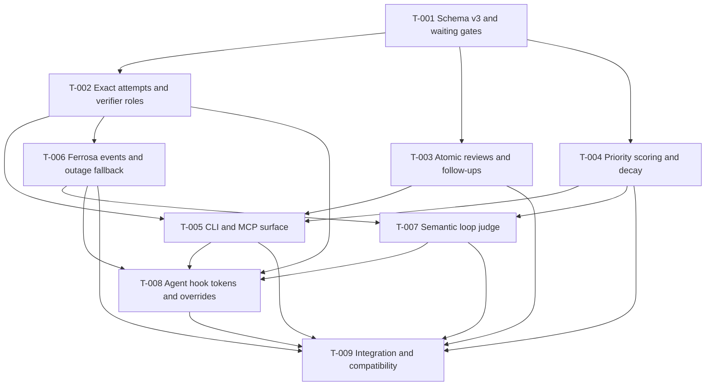

# Compiled Implementation Plan: Forge Anti-Loop Control

> Generated: 2026-07-12
> Status: Historical plan — core checklist-state packets shipped in v0.14.0; external integration packets remain follow-on work
> Execution policy: one mutating worker in this worktree (`serial_code`)
> Source: [Forge anti-loop attempt control](anti-loop-attempt-control.md)

## Dependency graph



## Execution rules

- Each packet is one bounded RED-GREEN-REFACTOR behavior group.
- Capture RED once and independently confirm it once. Do the same for GREEN.
- Do not claim a downstream packet before every dependency is complete.
- Use the current schema-v2 checklist as operational state while implementing
  schema v3.
- Do not persist raw command output in Ferrosa or fallback journals.
- No agent may force a loop, gate, score, or review override.

## T-001: Schema v3 and waiting gates

Add backward-compatible optional v3 fields to `forge-checklist-state`: the
`waiting` status, typed `review|decision|external|loop_detected` gates, goal and
priority inputs, bounded attempt state, and lease release on entry to waiting.

Acceptance:

- Old flat v1 and DAG v2 fixtures deserialize unchanged.
- Waiting without a typed gate is rejected by validation.
- Entering waiting clears claim and lease state.
- Waiting dependencies are not ready.

Verification:

```text
cargo test -p forge-checklist-state schema_v3
cargo test -p forge-checklist-state waiting
cargo test -p forge-checklist-state old_flat_checklist_json_loads
```

## T-002: Exact attempts and verifier roles

Implement normalized scoped fingerprints, attempt start/finish state, stable
attempt IDs, implementer/verifier roles, one exact independent verification,
bounded transient retry policy, and third-attempt `loop_detected` transition.

Verification:

```text
cargo test -p forge-checklist-state attempt
cargo test -p forge-checklist-state verifier
```

## T-003: Atomic reviews and follow-ups

Implement approved/disapproved review records and one atomic mutation that
creates typed `required|optional|informational` follow-ups. Approval completes
the source item; disapproval returns it to pending and adds required follow-ups
as dependencies.

Verification:

```text
cargo test -p forge-checklist-state review
cargo test -p forge-checklist-state follow_up
```

## T-004: Priority scoring and decay

Implement explainable effective scores from base priority, ease, DAG unlock
value, goal progress, human preference, decaying retry/fixation penalties,
parent-goal penalties, and critical visibility floors. A single stuck child
must not penalize its parent goal.

Verification:

```text
cargo test -p forge-checklist-state score
cargo test -p forge-checklist-state priority
```

## T-005: CLI and MCP surface

Expose waiting, review, resolve, attempt start/finish, scored ready, and score
explanation operations through CLI and MCP without expanding policy logic in
the handler layer.

Verification:

```text
cargo test -p forge-cli checklist
cargo test -p forge-mcp-server checklist
```

## T-006: Ferrosa events and outage fallback

Add normalized meaningful events for RED, GREEN, verification, blocker, and
review-ready; redact argv; perform the bounded handshake/write retry; activate
JSONL only during outage; reconcile idempotently and delete after acknowledgment.

Verification:

```text
cargo test -p forge-fmem-client attempt_event
cargo test -p forge-fmem-client reconciliation
```

## T-007: Semantic loop judge

Retrieve repository/goal-scoped attempt history, classify productive,
verification, productive-retry, loop, or uncertain, warn at medium confidence,
block at high confidence or two similar low-progress attempts, escalate once to
a stronger independent model, and fail open when no independent judge exists.

Verification:

```text
cargo test -p forge-fmem-client loop_judge
cargo test -p forge-fmem-client judge_unavailable_fails_open
```

## T-008: Agent hook tokens and override audit

Add agent-scoped pre/post command hooks backed by single-use attempt tokens.
Observation commands remain non-attempts. Agents cannot force overrides; human
overrides require identity and reason and become permanent meaningful events.

Verification:

```text
cargo test -p forge-cli attempt_token
bash tools/forge/hooks/test-anti-loop-hooks.sh
```

## T-009: Integration and compatibility

Prove old checklist compatibility, CLI/MCP parity, scored automatic scheduling,
critical waiting visibility, Ferrosa outage recovery, review atomicity, false
positive overrides, and token-conservation behavior across the full workspace.

Verification:

```text
cargo fmt --all -- --check
cargo clippy --workspace --all-targets -- -D warnings
cargo test --workspace
cargo doc --workspace --no-deps
```
