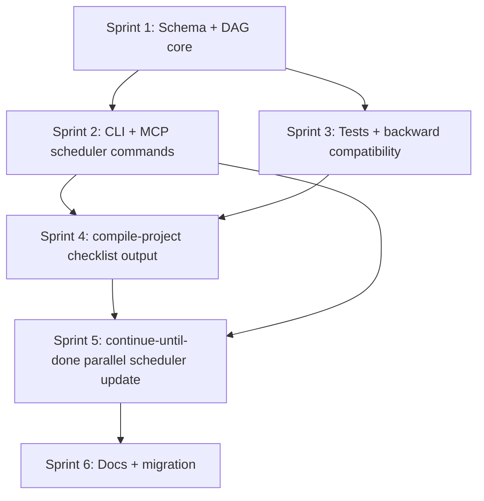

# Project Plan: Forge Dependency-Aware Checklists + compile-project DAG Output

> Last updated: 2026-04-27
> Status: draft
> Source: /project-management
> Scope: `the Forge repository` plus `$FORGE_SKILL_CATALOG_DIRtask-level/compile-project`

## Executive Summary

Forge already has persistent flat checklist state in `crates/checklist-state`, and `compile-project` already describes a RALPH dependency DAG in markdown. This project adds optional dependency metadata and scheduler primitives to Forge checklists, then updates `compile-project` so every compiled plan also writes an executable `.forge/checklists/<plan>.json` DAG checklist that agents can drain safely and in parallel where possible.

## Current State

- Forge checklist backend: `crates/checklist-state/src/lib.rs`
  - `ChecklistItem { id, title, status, completed_at, notes }`
  - `Checklist { name, created, updated, source_skill, items }`
  - API: `create`, `list`, `show`, `set`, `note`, `delete`
- CLI integration: `crates/cli/src/main.rs`
  - `frg checklist create|list|show|set|note|delete`
- MCP integration: `crates/cli/src/main.rs`
  - `checklist_state` modes: `create|list|show|set|note|delete`
- compile-project skill: `the compile-project skill`
  - Produces `specs/compiled-project-plan.md`
  - Specifies dependency DAG, parallel batches, and task packets in markdown
  - Does not yet create a Forge checklist artifact

## Target Behavior

1. Flat checklists continue to work unchanged.
2. A checklist item may optionally declare dependencies and scheduling metadata.
3. Forge can compute ready items: `pending` items whose dependencies are all `completed`.
4. Forge can validate DAG integrity: unknown dependencies, self-dependencies, and cycles fail loudly.
5. Forge can atomically claim ready work for parallel agents using a lease.
6. `compile-project` emits both:
   - `specs/compiled-project-plan.md`
   - `.forge/checklists/<plan-name>.json`
7. `continue-until-done` can use `ready`/`claim` to launch parallel work up to a safe concurrency limit.

## Assumptions

| # | Assumption | Status | Impact if Wrong |
|---|------------|--------|-----------------|
| A1 | Existing checklist JSON can tolerate additive optional fields. | validated by serde defaults design, not yet tested | If false, schema migration must be explicit and more invasive. |
| A2 | Same-tree parallel coding is unsafe by default. | validated by repo practice | Scheduler should expose ready sets, but execution policy should default to serial-code or worktree isolation. |
| A3 | compile-project can create files and/or call `frg checklist` as part of its skill workflow. | unvalidated | If false, it should emit a JSON artifact for a human/agent to import manually. |
| A4 | First-class Forge support is better than encoding dependencies in `notes`. | validated by maintainability | If deprioritized, a short-term notes parser can unblock the skill but increases fragility. |

## Dependencies

| # | Dependency | Owner | Due Date | Status |
|---|------------|-------|----------|--------|
| D1 | Rust skill/tooling for Forge development (`cargo test`, `clippy`, `fmt`). | implementation agent | Sprint 1 | available |
| D2 | Existing `compile-project` skill task packet format. | implementation agent | Sprint 4 | available |
| D3 | `continue-until-done` skill uses Forge checklist state. | implementation agent | Sprint 5 | created; needs DAG update |

## Proposed Checklist Schema v2

All new fields are optional so old checklists deserialize unchanged.

```json
{
  "name": "compiled-project-plan",
  "schema_version": 2,
  "created": "2026-04-27T00:00:00Z",
  "updated": "2026-04-27T00:00:00Z",
  "source_skill": "compile-project",
  "source_plan": "specs/compiled-project-plan.md",
  "parallel_policy": "worktree_required",
  "batch_verification": [
    { "batch": 1, "command": "cargo test -p forge-checklist-state" }
  ],
  "items": [
    {
      "id": "T-001",
      "title": "Add dependency fields to ChecklistItem",
      "status": "pending",
      "depends_on": [],
      "batch": 1,
      "verification": ["cargo test -p forge-checklist-state"],
      "source_refs": ["specs/checklist-dag-project-plan.md#sprint-1"],
      "claimed_by": null,
      "lease_expires_at": null,
      "notes": null
    },
    {
      "id": "T-002",
      "title": "Add ready-set calculation",
      "status": "pending",
      "depends_on": ["T-001"],
      "batch": 2
    }
  ]
}
```

### Rust Data Model Additions

- `Checklist.schema_version: Option<u32>` or `u32` with `#[serde(default = "default_schema_version")]`
- `Checklist.source_plan: Option<String>`
- `Checklist.parallel_policy: Option<ParallelPolicy>`
- `Checklist.batch_verification: Vec<BatchVerification>` with default empty
- `ChecklistItem.depends_on: Vec<String>` with default empty
- `ChecklistItem.batch: Option<u32>`
- `ChecklistItem.verification: Vec<String>` with default empty
- `ChecklistItem.source_refs: Vec<String>` with default empty
- `ChecklistItem.claimed_by: Option<String>`
- `ChecklistItem.lease_expires_at: Option<DateTime<Utc>>`

## CLI / MCP Surface

### CLI

Keep existing commands unchanged and add:

```bash
frg checklist create-dag <name> --file checklist.json
frg checklist validate <name>
frg checklist ready <name> [--limit N] [--include-expired-leases]
frg checklist claim <name> --agent <agent-id> [--limit N] [--lease-minutes 60]
frg checklist release <name> <item-id> [--agent <agent-id>]
```

Optional later:

```bash
frg checklist import-plan specs/compiled-project-plan.md --name compiled-project-plan
```

`import-plan` is useful only if compile-project output remains markdown-first. Preferred v1 is for compile-project to directly create `.forge/checklists/<name>.json`.

### MCP

Extend `checklist_state.mode` enum:

```text
create | create_dag | list | show | validate | ready | claim | release | set | note | delete
```

New parameters:

- `items`: array of rich item objects for `create_dag`
- `agent_id`: required for `claim`, optional for `release`
- `limit`: max ready/claim count
- `lease_minutes`: claim lease duration
- `include_expired_leases`: bool

## Dependency and Scheduling Semantics

```text
ready(item) =
  item.status == pending
  AND every dependency id exists
  AND every dependency status == completed
  AND item has no active unexpired lease
```

Rules:

- `depends_on` may reference only item ids in the same checklist.
- Self-dependencies are invalid.
- Cycles are invalid.
- Missing dependencies are invalid.
- Blocked dependency means dependents are not ready.
- Expired leases may be reclaimed by `claim` only when `--include-expired-leases` or default reclaim behavior is enabled.
- Existing `set` remains a low-level escape hatch; `claim` is the scheduler-safe path.

## Parallel Execution Policy

Forge should expose ready/claim primitives; agents decide how to execute. Recommended policies:

| Policy | Meaning | Default Use |
|--------|---------|-------------|
| `serial_code` | Only one mutating coding item at a time. | safest fallback |
| `same_tree_readonly` | Parallel items may only read/analyze. | audits/research |
| `worktree_required` | Each claimed mutating task needs a separate git worktree/branch. | compile-project DAGs |

For `compile-project`, default `parallel_policy` should be `worktree_required` unless the generated plan declares all tasks read-only.

## Dependency DAG



## Sprint Plan

### Sprint 1: Checklist DAG Core (Priority: Critical)

**Goal:** Add backward-compatible dependency metadata and pure scheduler logic to `forge-checklist-state`.
**Duration:** 1–2 days
**Definition of Done:** Old checklists load; dependency checklists validate; ready-set calculation works in pure unit tests.

| # | Task | Description | Success Criteria | Tests | Estimate | Status |
|---|------|-------------|------------------|-------|----------|--------|
| 1.1 | Schema v2 fields | Add optional fields to `Checklist` and `ChecklistItem` with serde defaults. | Existing JSON fixtures deserialize; new fields serialize only when non-empty where appropriate. | Unit fixture: old flat checklist + v2 DAG checklist. | S | todo |
| 1.2 | Dependency validation | Implement `validate_dependencies(&Checklist) -> Result<ValidationReport>` covering missing ids, self-deps, duplicate ids, and cycles. | Invalid DAGs fail loud with named item ids. | Unit tests for missing, self, cycle, duplicate. | M | todo |
| 1.3 | Topological batches | Implement `derive_batches(&Checklist) -> Result<Vec<Vec<String>>>` for items with/without explicit batch. | Batch output matches expected topological layers. | Unit test diamond DAG and disconnected nodes. | M | todo |
| 1.4 | Ready-set calculation | Implement `ready_items(&Checklist, now, include_expired_leases)`. | Only pending items with completed deps are ready. | Unit tests for pending/completed/blocked/in_progress deps and leases. | M | todo |
| 1.5 | Claim/release API | Add pure public APIs `claim` and `release` with lease fields and atomic write path reuse. | Claim updates status, claimed_by, lease_expires_at; release clears claim and returns pending. | Unit tests with tempdir. | M | todo |

**Quality Gates:**
- [ ] `cargo test -p forge-checklist-state`
- [ ] `cargo fmt --check`
- [ ] No API breakage for existing `create/list/show/set/note/delete`

### Sprint 2: CLI + MCP Scheduler Surface (Priority: Critical)

**Goal:** Expose dependency-aware operations through `frg checklist` and `checklist_state` MCP.
**Duration:** 1 day
**Definition of Done:** Agents can discover ready work and atomically claim it via CLI or MCP.

| # | Task | Description | Success Criteria | Tests | Estimate | Status |
|---|------|-------------|------------------|-------|----------|--------|
| 2.1 | CLI subcommands | Add `create-dag`, `validate`, `ready`, `claim`, `release` to `ChecklistAction`. | `frg checklist --help` shows new commands; JSON output is stable. | CLI smoke tests if current test harness supports it; otherwise unit command handler tests. | M | todo |
| 2.2 | MCP modes | Extend `checklist_state` mode enum/schema and handler for `create_dag`, `validate`, `ready`, `claim`, `release`. | MCP tool returns structured JSON for all new modes. | Handler tests or manual `frg --mcp` JSON-RPC smoke. | M | todo |
| 2.3 | Structured reports | Define `ReadyReport`, `ClaimReport`, and `ValidationReport` types. | Output includes counts, item ids, blockers, and validation errors. | Snapshot/golden JSON tests. | S | todo |
| 2.4 | Error messages | Make all dependency errors actionable. | Errors name checklist, item, dependency, and recovery hint. | Unit assertions on error text. | S | todo |

**Quality Gates:**
- [ ] `cargo test -p forge-cli checklist`
- [ ] `frg checklist create-dag --help`
- [ ] MCP schema includes new modes and params

### Sprint 3: Compatibility + Safety Testing (Priority: High)

**Goal:** Prove old state remains valid and parallel claims do not corrupt checklist files.
**Duration:** 1 day
**Definition of Done:** Backward compatibility and atomic-write behavior are tested.

| # | Task | Description | Success Criteria | Tests | Estimate | Status |
|---|------|-------------|------------------|-------|----------|--------|
| 3.1 | Old fixture compatibility | Add checked-in fixture for current v1 flat checklist. | Loading and showing old fixture preserves semantics. | Unit fixture test. | S | todo |
| 3.2 | Claim idempotency | Define behavior when an item is already claimed by same/different agent. | Same agent can renew; different agent cannot steal unexpired lease. | Unit tests. | M | todo |
| 3.3 | Expired lease reclaim | Implement deterministic reclaim semantics. | Expired claims can be reclaimed; active claims cannot. | Unit tests with fixed timestamps. | M | todo |
| 3.4 | Concurrent write smoke | Existing atomic write pattern still yields valid JSON after overlapping writes. | No partial JSON; last-write-wins accepted. | Threaded tempdir test or documented limitation. | M | todo |

**Quality Gates:**
- [ ] `cargo test -p forge-checklist-state`
- [ ] `cargo test -p forge-cli`

### Sprint 4: compile-project Emits Forge Checklist (Priority: Critical)

**Goal:** Update the compile-project skill so generated plans include an executable Forge DAG checklist.
**Duration:** 0.5–1 day
**Definition of Done:** New compile-project instructions require `.forge/checklists/<plan-name>.json` with dependency metadata.

| # | Task | Description | Success Criteria | Tests | Estimate | Status |
|---|------|-------------|------------------|-------|----------|--------|
| 4.1 | SKILL.md output contract | Update `compile-project/SKILL.md` Process: init/update/status/validate to include Forge checklist artifact. | Skill clearly names both outputs and when to create/update/delete checklist state. | Read-through review. | S | todo |
| 4.2 | Task template fields | Update `task-template.md` to include `id`, `depends_on`, `batch`, `verification`, `source_refs`, and checklist mapping rules. | Agents can generate checklist items mechanically from task packets. | Template review. | S | todo |
| 4.3 | Update RALPH loop section | Replace markdown-only claiming with Forge `ready`/`claim` semantics. | Section points to `mcp_forge_checklist_state`/`frg checklist` commands. | Read-through review. | S | todo |
| 4.4 | Status command integration | Update `/compile-project status` behavior to read Forge checklist when present. | Status reports completed/in-progress/blocked/ready counts from checklist. | Manual dry-run on example plan. | M | todo |
| 4.5 | Example checklist fixture | Add a small example `.json` in the skill folder or docs showing a 3-task DAG. | Future agents have an exact schema example. | JSON validates with `frg checklist validate`. | S | todo |

**Quality Gates:**
- [ ] `frg checklist validate <example>` passes once CLI exists
- [ ] Mermaid DAG in generated plan remains valid
- [ ] Skill remains under 500 lines or moves examples to supplementary files

### Sprint 5: continue-until-done Parallel Scheduler Update (Priority: High)

**Goal:** Update the new `continue-until-done` skill to use ready/claim and dispatch parallel tasks safely.
**Duration:** 0.5 day
**Definition of Done:** Skill can drain dependency-aware checklists serially or in controlled parallel mode.

| # | Task | Description | Success Criteria | Tests | Estimate | Status |
|---|------|-------------|------------------|-------|----------|--------|
| 5.1 | Ready/claim protocol | Replace first-pending selection with `ready` + `claim`. | No dependent item is selected before prerequisites complete. | Manual checklist dry-run. | S | todo |
| 5.2 | Parallel policy | Add `--parallel`, `--max-concurrent`, and worktree safety guidance. | Same-tree mutating work defaults to serial; worktree mode can launch parallel subagents. | Skill review. | M | todo |
| 5.3 | Batch verification | If all items in a batch complete, run batch verification before next batch. | Failing batch verification blocks downstream items. | Manual fixture dry-run. | M | todo |

**Quality Gates:**
- [ ] Skill final summary includes ready/completed/blocked counts
- [ ] Skill refuses unsafe same-tree parallel mutation by default

### Sprint 6: Documentation + Migration (Priority: Medium)

**Goal:** Document the feature and close the original checklist-state TODO.
**Duration:** 0.5 day
**Definition of Done:** Users and agents know how to create, inspect, and execute DAG checklists.

| # | Task | Description | Success Criteria | Tests | Estimate | Status |
|---|------|-------------|------------------|-------|----------|--------|
| 6.1 | Update feature spec | Extend `specs/todo/feat-checklist-state.md` or create a follow-up spec for DAG checklists. | Spec records v2 schema and commands. | Review. | S | todo |
| 6.2 | Update README/help docs | Add dependency-aware checklist examples to Forge docs. | `frg checklist ready/claim` discoverable. | `frg checklist --help`. | S | todo |
| 6.3 | Promote implemented work | Move/update TODO specs according to Forge workflow when complete. | `specs/implemented/` entry exists after verification. | Manual. | S | todo |

## Backlog

| # | Item | Description | Priority | Source |
|---|------|-------------|----------|--------|
| B1 | Worktree orchestrator | Add `frg checklist dispatch` to create per-task worktrees and launch agents automatically. | H | parallel execution risk |
| B2 | Import markdown DAG | Parse Mermaid/task packet markdown into checklist JSON. | M | fallback for old compile-project plans |
| B3 | Cross-checklist dependencies | Allow dependencies between named checklists. | L | future large programs |
| B4 | Priority scheduling | Add `priority` and `critical_path_rank` fields. | M | scheduler optimization |
| B5 | Stale claim cleanup | Add `frg checklist reap-expired <name>`. | M | lease operations |

## Risk Register

| # | Risk | Probability | Impact | Mitigation | Owner |
|---|------|-------------|--------|------------|-------|
| R1 | Existing checklists fail to deserialize after schema changes. | M | H | Add serde defaults and old-schema fixtures before new CLI work. | implementation agent |
| R2 | Parallel agents edit same files and overwrite each other. | H | H | Forge exposes ready/claim only; `continue-until-done` defaults mutating work to serial unless worktree mode is explicit. | implementation agent |
| R3 | Claim is not truly atomic under concurrent processes. | M | M | Use existing temp+rename, document last-write-wins limits, consider lockfile if tests show lost updates. | implementation agent |
| R4 | compile-project checklist generation is inconsistent because it is skill-driven. | M | M | Add exact JSON example and mechanical mapping rules; prefer `frg checklist create-dag --file` validation. | implementation agent |
| R5 | DAG validation blocks useful partial plans. | L | M | Provide actionable validation report and allow flat checklists for simple workflows. | implementation agent |

## Quality Standards

- Backward compatibility: all existing checklist JSON remains valid.
- Fail-loud validation: cycles, missing dependencies, duplicate ids, and invalid claims return structured errors.
- Verification before completion: scheduler support must not encourage marking items complete without evidence.
- Output stability: CLI and MCP JSON reports should be predictable enough for agents to parse.
- Rust gates: `cargo fmt --check`, targeted `cargo test`, and clippy where feasible.

## Acceptance Criteria

1. A flat checklist created by current `frg checklist create` still loads and can be updated.
2. A DAG checklist can be created/imported with item dependencies.
3. `frg checklist validate <name>` detects missing dependencies and cycles.
4. `frg checklist ready <name>` returns only unblocked pending items.
5. `frg checklist claim <name> --agent A --limit N` marks ready items in-progress with lease metadata.
6. MCP `checklist_state` supports equivalent dependency-aware modes.
7. `compile-project` instructions require creation of `.forge/checklists/<plan-name>.json` with `depends_on`, `batch`, `verification`, and `source_refs` for each task packet.
8. `continue-until-done` uses `ready`/`claim` and respects `parallel_policy`.

## Initial Implementation Checklist

This can be loaded into the current flat Forge checklist immediately:

```bash
frg checklist create checklist-dag-implementation --items \
"Schema v2 fields and old-fixture compatibility,Dependency validation and topological batches,Ready-set calculation and claim/release API,CLI ready/claim/validate/create-dag commands,MCP checklist_state ready/claim/validate/create_dag modes,Compatibility and lease tests,Update compile-project skill checklist output contract,Update continue-until-done skill ready/claim loop,Docs and spec promotion"
```
