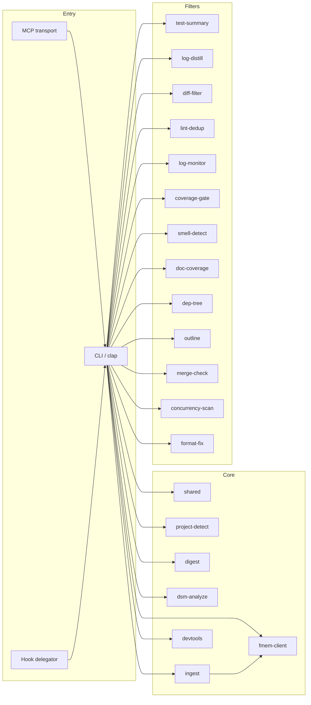

# Forge Components

> Last updated: 2026-04-07
> Status: Draft

## Component Diagram

## Responsibilities

### `crates/cli`

- Binary entrypoint
- `clap` subcommand surface
- MCP tool registration and handler wiring
- Hook installation, inspection, and delegator behavior
- Ferrosa-memory config resolution and load/no-load branching

### `crates/mcp-server`

- JSON-RPC stdio loop
- `initialize`, `tools/list`, and `tools/call`
- Tier-based tool filtering using detected stacks

### `crates/shared`

- Analytics persistence
- Filter registry helpers
- tee/raw-output capture
- common config and utility code

### `crates/devtools`

- Structured wrappers around language-native toolchains
- Rust, Python, Go, Elixir, Node, git, docker, and CI-related commands
- Shared runner abstraction for command execution and truncation

### `crates/digest`

- Outline generation for files and directories
- symbol excerpt extraction
- symbol lookup across the project

### `crates/project-detect`

- Stack, language, and framework detection
- project summary for architecture/recon workflows
- input to tier-2 MCP tool visibility

### `crates/dsm-analyze`

- dependency extraction
- cycle detection
- clustering, metrics, partitioning, reporting, and enforcement generation

### `crates/ingest`

- codebase ingestion
- web ingestion via `url.rs`
- academic paper ingestion via `paper.rs`
- **skill-catalog ingestion** via `skill_ingest/` (walk, parse, hash,
  secret-scan gate, supplementary resolution, collision detection,
  taxonomy plan builder)
- sanitization and ferrosa-memory loading

### `crates/fmem-client`

- MCP JSON-RPC client used by forge admin commands
- `StdioTransport` — subprocess-based transport with strict id matching
  and per-call deadlines
- `MockTransport` — scriptable in-memory transport for tests
- Typed tool wrappers: `ingest_skill` today; `ensure_parent_tag` +
  `verify_skill` pending the fmem `skill-ingest-support` spec
- `initialize` handshake with protocol-version assert

### Filter and Analysis Crates

- `test-summary`, `log-distill`, `diff-filter`, `lint-dedup`, `log-monitor`
- `coverage-gate`, `smell-detect`, `doc-coverage`
- `dep-tree`, `outline`, `merge-check`, `concurrency-scan`, `format-fix`

These crates stay narrow: parse one class of input, emit bounded structured output, and avoid cross-cutting orchestration logic.

## Boundary Rules

- New end-user commands are registered in `crates/cli`, but domain logic belongs in a library crate
- MCP transport stays generic; tool semantics stay in the CLI/library boundary
- Shared utilities should remain transport-agnostic
- Specs for workspace architecture live in `specs/`, not the repository root `specs/`
