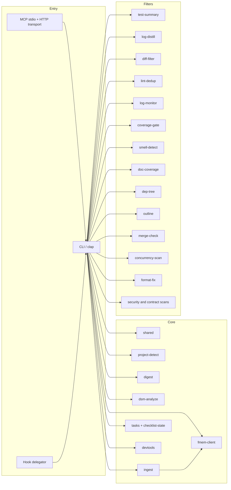

# Forge Components

> Last updated: 2026-07-21
> Status: Current architecture reference

## Component Diagram

```mermaid
graph LR
    subgraph Entry
        CLI[CLI / clap]
        Hook[Hook delegator]
        MCP[MCP stdio + HTTP transport]
    end

    subgraph Core
        Shared[shared]
        Detect[project-detect]
        Digest[digest]
        Dsm[dsm-analyze]
        Ingest[ingest]
        Tasks[tasks + checklist-state]
        Devtools[devtools]
        FmemClient[fmem-client]
    end

    subgraph Filters
        TS[test-summary]
        LD[log-distill]
        DF[diff-filter]
        Lint[lint-dedup]
        LM[log-monitor]
        Cov[coverage-gate]
        Smell[smell-detect]
        Doc[doc-coverage]
        Dep[dep-tree]
        Outline[outline]
        Merge[merge-check]
        Conc[concurrency-scan]
        Fmt[format-fix]
        Security[security and contract scans]
    end

    CLI --> Shared
    CLI --> Detect
    CLI --> Digest
    CLI --> Dsm
    CLI --> Ingest
    CLI --> Tasks
    CLI --> Devtools
    CLI --> FmemClient
    Ingest --> FmemClient
    CLI --> TS
    CLI --> LD
    CLI --> DF
    CLI --> Lint
    CLI --> LM
    CLI --> Cov
    CLI --> Smell
    CLI --> Doc
    CLI --> Dep
    CLI --> Outline
    CLI --> Merge
    CLI --> Conc
    CLI --> Fmt
    CLI --> Security
    MCP --> CLI
    Hook --> CLI
```

## Responsibilities

### `crates/cli`

- Binary entrypoint
- `clap` subcommand surface
- MCP tool registration and handler wiring
- Hook installation, inspection, and delegator behavior
- Ferrosa-memory config resolution and load/no-load branching

### `crates/mcp-server`

- JSON-RPC stdio loop and Streamable HTTP `POST /mcp` endpoint
- legacy `initialize` plus draft `server/discover`, `tools/list`, and `tools/call`
- modern result metadata, tool output schemas, and cache metadata
- HTTP request-size, origin, method, and mirrored-header validation
- Tier-based tool filtering using detected stacks

### `crates/shared`

- Analytics persistence
- Filter registry helpers
- tee/raw-output capture
- common config and utility code

### `crates/devtools`

- Structured wrappers around language-native toolchains
- Rust, Python, Go, Elixir, Node, git, docker, and CI-related commands
- Shared runner abstraction for command execution and truncation

### `crates/digest`

- Outline generation for files and directories
- symbol excerpt extraction
- symbol lookup across the project

### `crates/project-detect`

- Stack, language, and framework detection
- project summary for architecture/recon workflows
- input to tier-2 MCP tool visibility

### `crates/dsm-analyze`

- dependency extraction
- cycle detection
- clustering, metrics, partitioning, reporting, and enforcement generation

### `crates/ingest`

- codebase ingestion
- web ingestion via `url.rs`
- academic paper ingestion via `paper.rs`
- **skill-catalog ingestion** via `skill_ingest/` (walk, parse, hash,
  secret-scan gate, supplementary resolution, collision detection,
  taxonomy plan builder)
- sanitization and ferrosa-memory loading

### `crates/tasks` and `crates/checklist-state`

- CQL-backed task board, task links, and comments
- project-local JSON checklist state with dependencies, leases, bounded attempts,
  waiting gates, reviews, and scoring
- typed state transitions used by the CLI and `checklist_state` MCP tool

### `crates/fmem-client`

- MCP JSON-RPC client used by ingestion and admin commands
- `StdioTransport` — subprocess-based transport with strict id matching
  and per-call deadlines
- `HttpTransport` — HTTP calls with modern request metadata and mirrored headers
- `MockTransport` — scriptable in-memory transport for tests
- Typed wrappers for supported ferrosa-memory operations
- `server/discover` negotiation with legacy `initialize` fallback

### Filter and Analysis Crates

- `test-summary`, `log-distill`, `diff-filter`, `lint-dedup`, `log-monitor`
- `coverage-gate`, `smell-detect`, `doc-coverage`
- `dep-tree`, `outline`, `merge-check`, `concurrency-scan`, `format-fix`
- `materialization-scan`, `mermaid-validate`, `secret-scan`, `deps-audit`,
  `threat-scan`, `fail-loud-scan`, `todo-extract`, `schema-diff`, and `api-diff`

These crates stay narrow: parse one class of input, emit bounded structured output, and avoid cross-cutting orchestration logic.

## Boundary Rules

- New end-user commands are registered in `crates/cli`, but domain logic belongs in a library crate
- MCP transport stays generic; tool semantics stay in the CLI/library boundary
- Shared utilities should remain transport-agnostic
- Specs for workspace architecture live in `specs/`, not the repository root `specs/`
