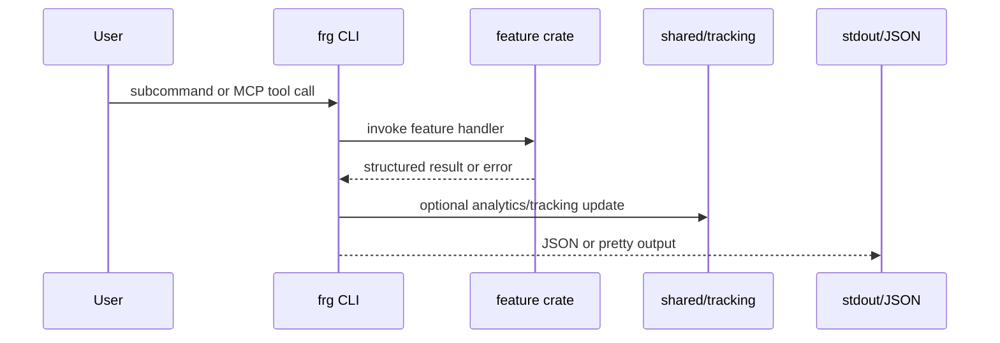
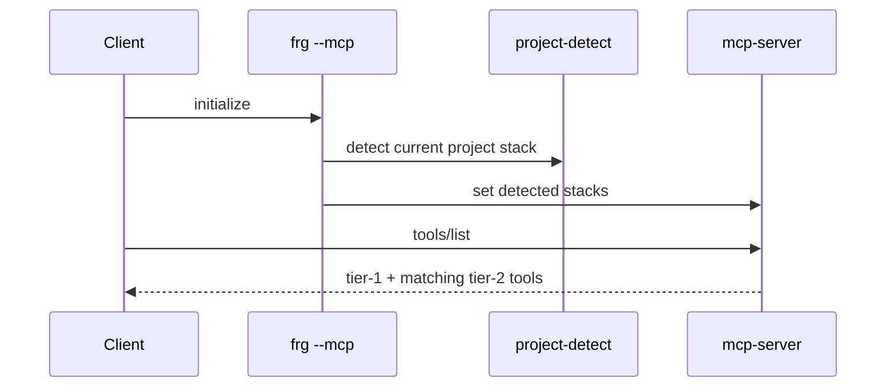
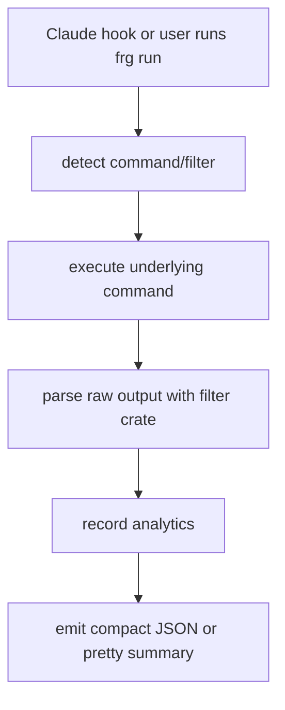
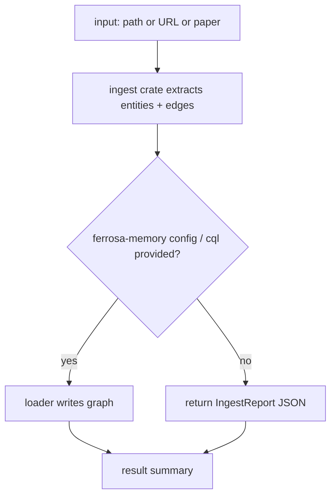
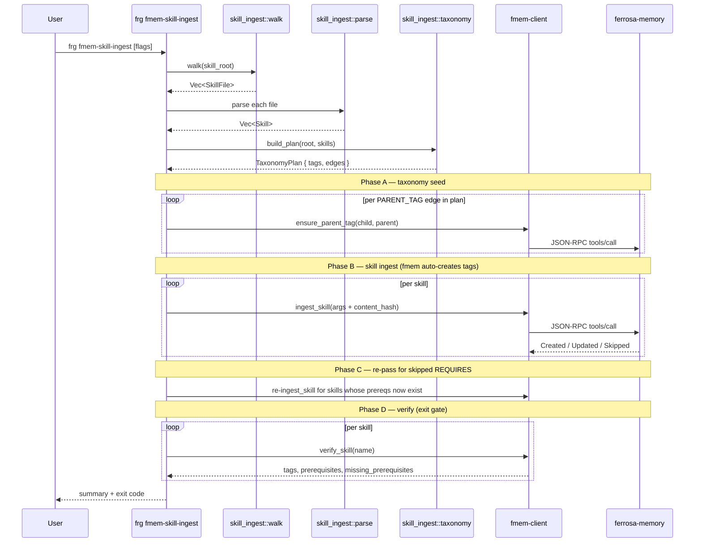

# Forge Data Flow

> Last updated: 2026-04-07
> Status: Draft

## Primary Runtime Flows

### CLI and MCP Request Flow

### MCP Tool Discovery Flow

### Proxy and Hook Flow

### Ingestion Flow

### Skill Catalog Ingestion Flow (`frg fmem-skill-ingest`)

See `specs/fmem-skill-ingest/` for the full blueprint of
this flow; `ensure_parent_tag` and `verify_skill` wrappers land once
`../../../ferrosa-memory/specs/todo/skill-ingest-support.md` ships.

## Important Data Paths

### Analytics

- Raw command sizes and filtered output sizes flow through `shared::tracking`
- Storage target is a local SQLite database
- Reporting surfaces through `gain`, `analytics`, and `clear-analytics`

### Configuration

- CLI and loaders read local config files for hook state, filters, and ferrosa-memory connectivity
- Hook generation writes canonical settings that delegate behavior back to the binary

### Knowledge Graph Output

- `ingest`, `ingest-url`, and `ingest-paper` all normalize into `IngestReport`
- Loader path branches on configured CQL contact points
- Sanitization strips unsafe or sensitive fields before persistence

## Drift Checks

Architecture updates should verify these still match the code:

- MCP tool tiering is enforced in `crates/mcp-server`
- `crates/cli` remains the only orchestration entrypoint
- ingestion still supports code, web, and paper modes
- hook flow still delegates through the canonical hook command
