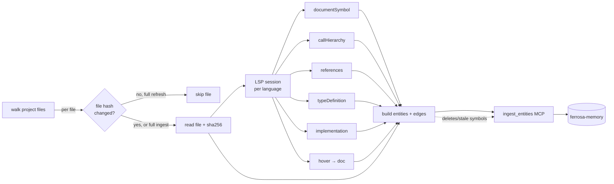

# feat-code-graph-ingest — Overview

> Status: Implemented (T1–T12 per this blueprint, plus T13–T15 added during execution). Shipped on `feat/code-graph-ingest-t11-cache` (PR #55).
> Owner crate: `forge-ingest`
> External dependency: ferrosa-memory `ingest_entities` MCP tool (available)
>
> Historical note: these specs are the pre-implementation blueprint. The
> shipped code is the source of truth; the specs are kept for design
> traceability and FMEA reference.

## Purpose

Upgrade forge's code ingestion so that agents can answer code-level questions ("where is `foo` called?", "what implements `Iterator`?", "show me the body of `bar`") by **walking the ferrosa-memory graph**, with no filesystem grep. The current extractor produces an architectural graph (crates, modules, module-level `use` edges). This feature adds a **code graph** (functions, methods, types, traits, files) with **call-site, reference, type, implementation, and containment edges**, plus the source text needed to read without touching the filesystem, plus **incremental refresh** so ingest cost tracks file churn, not repo size.

## Value

- Cuts agent tool calls: walking a graph is one MCP call; grep+read is several
- Turns cross-file navigation from O(files) scan into O(edges) hop
- Incremental refresh makes ingestion cheap enough to run on a save-hook
- Source-preserving entities let agents answer "what does this code do?" without filesystem access at all

## Current state (baseline)

| Facet | Today | After |
|---|---|---|
| Entity kinds | `crate`, `module`, `function`, `struct`, `enum`, `trait`, `constant`, `document`, `section`, `bug`, `code` | +`file`, +`method`, +`type`, +`parameter` |
| Source text | Signatures only (LSP `detail`), module summaries, first 500 chars of markdown | File bodies (capped) + symbol (start,end) ranges pointing into them |
| Private items | Skipped (`extractor.rs:338`) | Included |
| Edge types | `contains`, `depends_on`, `calls` (module-level `use` only), `references` (markdown word-match) | +`calls` (fn→fn, with call site), +`references` (symbol-level), +`has_type`, +`implements`, +`extends`, +`defined_in`, +`imports` (resolved), +`documents` (doc→symbol) |
| LSP methods used | `textDocument/documentSymbol` | +`callHierarchy/*`, +`textDocument/references`, +`textDocument/definition`, +`textDocument/typeDefinition`, +`textDocument/implementation`, +`textDocument/hover` |
| Refresh | Full re-ingest | File-hash + symbol-range-hash incremental |

## Scope

**In scope**

- Rust-first (rust-analyzer supports every LSP method we need)
- Tier 1: call hierarchy, references, type definitions, implementations
- Tier 2: source preservation (option b — file-level bodies + symbol ranges), private symbols, file entities
- Tier 3: hover/docstring extraction, import resolution, parameter entities
- **Refresh**: file-hash tracked; incremental re-extract of changed files + 1-hop reverse-dependency closure
- New `ingest_entities` call site replacing the Python `loader.rs` for code entities/edges

**Out of scope (this feature)**

- Languages beyond Rust (Python/TS/Go/Elixir — follow-on per language, same extractor shape)
- Full-repo content-addressed blob store (option c) — incremental refresh handles the storage-cost concern at the source
- Control-flow or data-flow edges
- Deleting the Python `loader.rs` (stays for non-code ingest — markdown, bugs, etc.) until a native Rust CQL client exists

## Storage model — option (b)

One `file` entity per ingested source file; symbol entities reference their file + (start_byte, end_byte, start_line, end_line) range.

- **`file` entity attrs**: `path`, `language`, `sha256` (of content), `bytes`, `lines`, `source_text` (capped at `MAX_FILE_BYTES`, default 128 KiB; truncation flag if hit), `generated_at`
- **Symbol entity attrs**: `file_id` (FK via `defined_in` edge), `range: {start_byte, end_byte, start_line, end_line}`, `source_hash` (sha256 of the sliced range — used for incremental symbol diff), `visibility: pub|crate|private`, optional `doc` (from hover), `signature` (from LSP detail)
- **Nested symbols** (method inside impl inside file): each has its own range; bodies overlap but are stored once at the file level, not per-symbol.

### Why not full body per symbol

A 2KB file with 10 fns would store ~12KB if each symbol duplicated its body. File-level with range pointers stores 2KB. At repo scale (10K files × avg 8 KiB), that's 80 MiB vs several hundred.

### Retrieval contract

Agents retrieving a symbol entity get the signature inline; to see the body, they follow `defined_in` → file, slice `source_text[start_byte..end_byte]`. This is **one MCP hop** and matches how LSPs natively represent location.

## Refresh model

Triggered by `frg ingest --refresh <path>` or the MCP `ingest_refresh` tool.

### Change detection

```
for each file in walk(root):
    h = sha256(file.content)
    if h == stored.file.sha256:   continue   # unchanged, skip
    changed_files += file
```

sha256, not md5 (same cost, no deprecation risk, already used for `source_hash`).

### Incremental re-extract

For each changed file:

1. **Re-extract symbols + edges for that file** (same pipeline as full ingest).
2. **Per-symbol diff**: compare new `source_hash` with stored; unchanged symbols keep their entity ids (preserves external references). Changed symbols get updated `source_text`/`range`/`doc` via `ingest_entities` with `on_conflict: update`.
3. **Deleted symbols** (present in stored, absent in new extraction): do not assume hard delete exists. Current default is to track deletions as a follow-on dependency and keep refresh add/update-only unless a separate soft-delete contract is explicitly implemented — **see open decision D1**.
4. **Reverse-reference closure (1 hop)**: any symbol with a `calls` or `references` edge pointing into the changed file is re-queried against the LSP to refresh its outgoing edges — cheap to find via the graph itself. Accept residual staleness beyond 1 hop; expose a `--deep-refresh` flag that closes transitively for consistency-sensitive callers.

### Persisted refresh state

Each `file` entity stores:
- `sha256` of the file content
- `last_refreshed_at`
- `extractor_version` — bumped when extractor logic changes; forces re-extract regardless of hash match

Forge-local cache (`.forge/cache/code-graph/<project-id>.toml`) mirrors the same map for cheap offline lookups; source of truth stays in ferrosa-memory.

## Entity + edge schema

### New entity kinds

| entity_type | Purpose | Key attrs |
|---|---|---|
| `file` | One per ingested source file | `path`, `language`, `sha256`, `source_text`, `bytes`, `lines`, `truncated` |
| `function` / `method` | Function-shaped symbol | `file_id`, `range`, `source_hash`, `signature`, `doc`, `visibility` |
| `type` | Struct/enum/typedef (merged; `kind` attr distinguishes) | same as above + `kind: struct|enum|typedef|union` |
| `trait` | Rust trait / TS interface | same |
| `parameter` | Function parameter (child of function) | `name`, `type_name`, `position` |

(Existing `crate`, `module`, `constant`, `document`, `section`, `bug` unchanged.)

### New edge types

| edge_type | Source → Target | Semantics | Metadata |
|---|---|---|---|
| `calls` | function → function | Call site resolved via `callHierarchy/incomingCalls` / `outgoingCalls` | `{call_file, call_line, call_col, call_count}` |
| `references` | symbol → symbol | Non-call reference (type mention, trait bound, use) | `{ref_file, ref_line, ref_col}` |
| `has_type` | function/parameter/field → type/trait | From `textDocument/typeDefinition` | — |
| `implements` | type → trait | `textDocument/implementation` (reverse from trait side) | — |
| `extends` | type → type | Class inheritance (non-Rust) | — |
| `defined_in` | symbol → file | Symbol's declaring file | — |
| `imports` | module → module | Resolved `use` / `import` (target is actual entity, not string) | — |
| `documents` | section/document → symbol | Docstring or comment describing a symbol | — |

## Data flow



## Interface contract

### CLI

```
frg ingest <path>                       # full ingest (unchanged behavior for non-code)
frg ingest <path> --code-graph          # new: opts into code-graph extraction
frg ingest <path> --refresh             # incremental by file hash
frg ingest <path> --refresh --deep      # transitive reverse-reference closure
frg ingest <path> --language rust       # scope to one language (default: auto-detect all)
```

### MCP tool

`ingest_refresh` — new tool, thin wrapper over the CLI refresh path. Returns `{files_scanned, files_changed, symbols_added, symbols_updated, symbols_deleted, edges_added, edges_deleted, duration_ms}`.

## Open decisions

| ID | Decision | Default | Need |
|---|---|---|---|
| D1 | Deletion mechanism for stale symbols | Keep deletion out of the first refresh slice; ship add/update refresh first | `ferrosa-memory` exposes `ingest_entities` today but not generic delete/update tools |
| D2 | `MAX_FILE_BYTES` cap | 128 KiB | Tune after ingesting a real project and measuring payload size |
| D3 | Private symbol inclusion toggle | Always on | Confirm — user asked for private included |
| D4 | Extractor version format | Semver on the `forge-ingest` crate | Simple enough; ADR |
| D5 | Parallelism: one LSP session per language, sequential file requests, or concurrent? | Sequential per-session (LSP is stateful) | Benchmark; revisit if slow on large repos |

## Dependencies

- `ferrosa-memory.ingest_entities` (done, per user)
- Generic `ferrosa-memory` delete/update tools are not available yet; treat delete-oriented refresh as a separate dependency
- `rust-analyzer` (already required)
- `sha2` crate (already a dep per `Cargo.toml`)
- No new crates expected

## Links

- Current Python loader: `crates/ingest/src/loader.rs` (stays for non-code ingest)
- Current LSP client: `crates/ingest/src/lsp.rs` (extended by this feature)
- Current extractor: `crates/ingest/src/extractor.rs` (extended)
- Related audit: see upstream thread "Does the graph let agents walk code without grep?"
