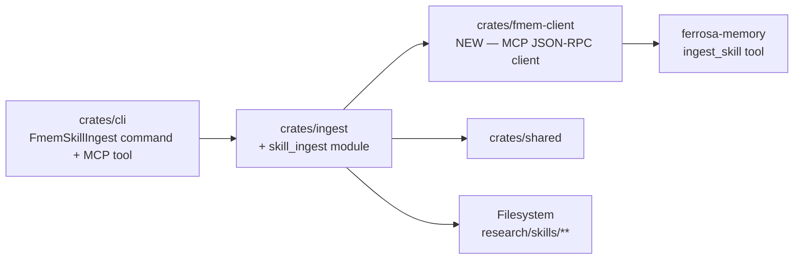
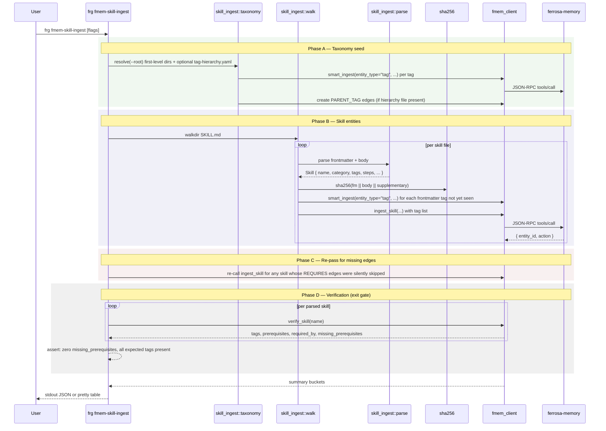

# fmem-skill-ingest Architecture

> Phase 1 of blueprint. Companion to the workspace-level `../components.md` and `../data-flow.md`.
> Updated 2026-04-16: added taxonomy pre-pass and per-skill tag resolution.

## Placement within the forge workspace

The feature fits cleanly into forge's existing component shape:

- **`crates/cli`** — register `FmemSkillIngest` subcommand variant; register matching MCP tool definition
- **`crates/ingest`** — host the new `skill_ingest` module alongside `extractor`, `paper`, `url`, `loader`
- **`crates/fmem-client`** (new) — MCP JSON-RPC client used by `skill_ingest` (and future admin commands)

This keeps the CLI crate thin (registration only) and puts domain logic in library crates, matching forge's boundary rule: *"new end-user commands are registered in `crates/cli`, but domain logic belongs in a library crate."*

### Component diagram (delta)

## Data flow

The updated spec introduces a three-phase orchestration: **taxonomy seed** first, **skill entities** second, **edges** third. This matches fmem's ingest semantics — a skill can `TAGGED_AS` a tag only after that tag exists, and `REQUIRES` / `RELATED_TO` edges between skills only resolve once all skills are present.

Updated for fmem Sprint 2 capabilities:
- **Phase A** seeds the tag taxonomy via `ensure_parent_tag(child, parent)` (a new fmem tool — see `../../../../ferrosa-memory/specs/todo/skill-ingest-support.md`). Unparented tags don't need explicit creation here — `ingest_skill` will create them as a side effect.
- **Phase B** is single-pass. `ingest_skill` auto-creates tag entities + TAGGED_AS edges from the skill's `category` and `tags:`; REQUIRES edges with missing prereqs are silently skipped server-side and filled in Phase C.
- **Phase C** re-runs `ingest_skill` for any skill that had skipped REQUIRES — this is the spec's "re-run later" path. Idempotent via content_hash.
- **Phase D** (new) calls `verify_skill(name)` for every parsed skill and asserts every declared tag and prerequisite landed an edge. Failed verification → exit 4. This is the hard exit gate — ingest is not "complete" until D passes.

## The MCP client decision

Finding 1 from `overview.md`: there is no existing forge→fmem MCP client. This blueprint takes **option A** — build it as part of this feature — and places it in a new `crates/fmem-client` crate rather than inside `crates/ingest`.

### Why a separate crate

- **Reuse.** Subsequent admin commands (`frg fmem-invoke-skill`, a future `frg fmem-retrieve`) will use the same client. Keeping it separate prevents re-exporting ingest symbols from unrelated commands.
- **Testability.** The client can be unit-tested with an in-memory mock of the JSON-RPC transport, independent of skill parsing.
- **Boundary clarity.** The client is transport code (JSON-RPC framing, timeouts, retries, connection handling). Skill parsing is domain code. They deserve separate modules with different review criteria (correctness hazards differ).

### Transport

MCP over stdio first (launch `fmem --mcp` as a subprocess), with HTTP as a follow-up. Stdio matches how Claude Code itself talks to fmem and avoids a second auth story.

### Typed tool wrappers (locked)

After Q&A on fmem capabilities, forge needs three fmem tool wrappers (not two, not one):

- `tools::ingest_skill` — for skill entities; fmem auto-creates tag entities + TAGGED_AS edges from `category` + `tags:`
- `tools::ensure_parent_tag` — name-keyed PARENT_TAG edge creation (depends on the fmem spec at `../../../../ferrosa-memory/specs/todo/skill-ingest-support.md`)
- `tools::verify_skill` — graph-neighborhood readback for the verification phase (same fmem spec)

The previously planned `tools::smart_ingest` (P5a) and `tools::create_edge` (P5b) wrappers are **dropped** from this feature: skill-tag creation is server-side and the only edge type forge creates explicitly (PARENT_TAG) goes through the higher-level `ensure_parent_tag`.

### Error surface

The client exposes a typed error enum with these variants:

- `TransportError` — subprocess spawn, stdio read/write, HTTP connect
- `ProtocolError` — malformed JSON-RPC, unknown response id
- `ToolError { code, message }` — fmem returned a JSON-RPC error
- `SchemaValidationError` — fmem rejected the payload
- `Timeout`

Fail-loud per repo convention: no silent retries, no default-value fallbacks. All five variants surface to the caller; the caller decides what to log, count, and exit on.

## Updates to existing architecture docs

After this feature lands, `../components.md` gains:

- A `crates/fmem-client` entry under "Core"
- An edge `cli → fmem-client` in the component diagram
- A `crates/ingest` responsibility bullet: "skill-catalog ingestion via `skill_ingest` module"

And `../data-flow.md` gains a new "Skill Ingestion Flow" sequence diagram modeled on the one above.

These updates are tracked in the project plan (Phase 6) as a sprint-closing documentation task, not something the first implementation PR must carry.

## Invariants

Invariants this feature must preserve:

- **I1**: `crates/cli` stays the only orchestration entrypoint.
- **I2**: Domain logic stays out of `crates/cli`.
- **I3**: MCP tool tiering is enforced in `crates/mcp-server` — this feature registers as tier-1 (always visible, `fmem-skill-ingest` is a generic admin tool).
- **I4**: Fail-loud — no silent fallbacks; every fmem error reaches the CLI exit code.
- **I5**: One-way sync — forge writes to fmem, never reads+writes back.
