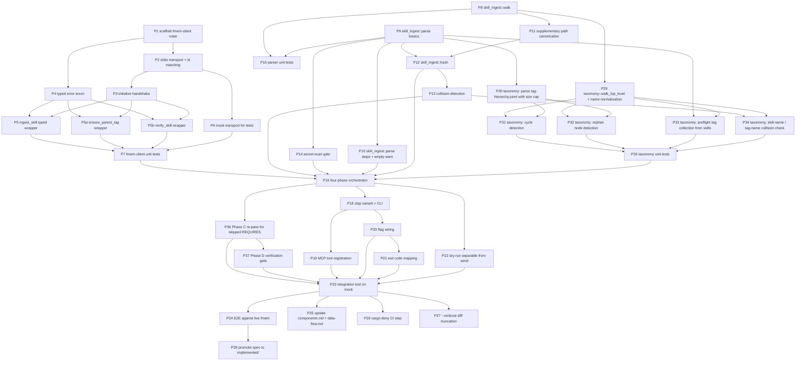

# fmem-skill-ingest — Compiled Project Plan

> Phase 10 of blueprint. Agent-executable task packets with dependency DAG and three-tier verification.
>
> Each packet is self-contained: an agent should be able to pick up any ready packet, read only the linked spec sections, and complete it without re-reading the whole blueprint. "Ready" means all `blocked_by` packets are `verified`.
> Updated 2026-04-16: added P5a/P5b (smart_ingest + create_edge wrappers) and P29–P35 for taxonomy pre-pass + tag resolution.
> **Locked 2026-04-16:** P5a redefined as `ensure_parent_tag` wrapper, P5b redefined as `verify_skill` wrapper (both depend on the new fmem spec at `../../../../ferrosa-memory/specs/todo/skill-ingest-support.md`). Added P36 (Phase C re-pass) and P37 (Phase D verification gate).

## Verification tiers

| Tier | Means | Who runs it |
|---|---|---|
| T1 | Compiles + unit tests pass + clippy + fmt | agent, pre-commit |
| T2 | Integration test against mock fmem passes | agent, CI on PR |
| T3 | E2E against live fmem passes acceptance criteria | human, post-merge |

Each packet declares the tier at which it is "done."

## Dependency DAG

## Parallel batches

Batches are sets of packets with no intra-batch dependencies — they can be dispatched concurrently.

- **Batch A** (no dependencies): P1, P8, P9
- **Batch B** (after A): P2, P4, P10, P11, P14, P15, P29, P30
- **Batch C**: P3, P12, P31, P32, P33
- **Batch D**: P5, P5a, P5b, P6, P13, P34
- **Batch E**: P7, P35
- **Batch F**: P16
- **Batch G**: P17, P18, P22
- **Batch H**: P19, P20
- **Batch I**: P21
- **Batch J**: P23
- **Batch K** (after J): P24, P25, P26, P27
- **Batch L**: P28

Single-engineer execution follows the topological order above but within a batch the order is free.

## Task packets

Every packet has the same shape: **goal**, **inputs** (spec sections to read — nothing else), **deliverables**, **verification tier**, **blocked_by**.

---

### P1 — Scaffold `crates/fmem-client`

- **Goal.** Create a new workspace crate with `src/lib.rs`, `transport/mod.rs`, `tools/mod.rs`, `error.rs` skeleton. No functional code yet — module tree only. Add to `Cargo.toml` workspace members.
- **Inputs.** `architecture.md` §"The MCP client decision"; `dsm.md` §"Module inventory"; existing `crates/ingest/Cargo.toml` for shape reference.
- **Deliverables.** Compiling crate exporting empty types; `cargo build -p forge-fmem-client` succeeds.
- **Tier.** T1.
- **Blocked by.** none.

### P2 — stdio transport + strict id matching

- **Goal.** Spawn `fmem --mcp` as a subprocess, JSON-RPC over stdio, `send_request(method, params) -> Result<Value, TransportError>` that matches responses by request id. Reject any response whose id doesn't match a pending request. Per-call timeout via `recv_timeout`.
- **Inputs.** `dsm.md` §"Dependency direction"; `threat-model.md` E1; `fmea.md` F12–F14; `rust-hazards.md` P0-6, P1-4.
- **Deliverables.** `transport::StdioTransport` with a typed send; unit tests for id matching, shuffle rejection, timeout, broken-pipe.
- **Tier.** T1.
- **Blocked by.** P1.

### P3 — `initialize` handshake + protocol version assert

- **Goal.** Perform MCP `initialize` on connect; compare advertised server version against a compiled-in constant; fail loud on mismatch with upgrade hint.
- **Inputs.** `fmea.md` F15.
- **Deliverables.** `StdioTransport::initialize` method; test with mock server advertising mismatched version.
- **Tier.** T1.
- **Blocked by.** P2.

### P4 — Typed error enum

- **Goal.** Define `fmem_client::error::Error` with exactly these variants: `Transport(io::Error)`, `Protocol(String)`, `Tool { code: i32, message: String }`, `Schema(String)`, `Timeout`. No `Other(String)`.
- **Inputs.** `architecture.md` §"Error surface"; `rust-hazards.md` fail-loud.
- **Deliverables.** `error.rs` with the enum, `std::error::Error` impl, `Display`; unit tests for each variant's `Display`.
- **Tier.** T1.
- **Blocked by.** P1.

### P5 — `ingest_skill` typed wrapper

- **Goal.** `tools::ingest_skill(transport: &T, args: IngestSkillArgs) -> Result<IngestSkillResponse, Error>` that serializes the JSON-RPC call, deserializes the response into typed `action: Created | Updated | Skipped`. `IngestSkillArgs` includes a `tags: Vec<String>` field per the updated spec.
- **Inputs.** `ferrosa-memory/specs/skills-layer-design.md` §"ingest_skill"; feature spec §"fmem call shape" + §"Tag resolution per skill"; `architecture.md` DSM edge `tools → transport`.
- **Deliverables.** `tools::ingest_skill` function, `IngestSkillArgs` and `IngestSkillResponse` structs with `serde` derives.
- **Tier.** T1.
- **Blocked by.** P3, P4.

### P5a — `ensure_parent_tag` typed wrapper

- **Goal.** `tools::ensure_parent_tag(transport: &T, args: EnsureParentTagArgs) -> Result<EnsureParentTagResponse, Error>`. Idempotent PARENT_TAG edge creation by tag name.
- **Inputs.** `architecture.md` §"Typed tool wrappers (locked)"; new fmem spec at `../../../../ferrosa-memory/specs/todo/skill-ingest-support.md` §"Tool 1".
- **Deliverables.** `tools::ensure_parent_tag` function; `EnsureParentTagArgs { child_tag: String, parent_tag: String }`; `EnsureParentTagResponse { action: Created | Skipped, child_id: Uuid, parent_id: Uuid }`.
- **Tier.** T1.
- **Blocked by.** P3, P4 + fmem `skill-ingest-support.md` shipped.

### P5b — `verify_skill` typed wrapper

- **Goal.** `tools::verify_skill(transport: &T, args: VerifySkillArgs) -> Result<VerifySkillResponse, Error>`. Read a skill's full graph neighborhood for the verification phase.
- **Inputs.** `architecture.md` §"Typed tool wrappers (locked)"; new fmem spec §"Tool 2".
- **Deliverables.** `tools::verify_skill` function; `VerifySkillArgs { skill_name: String }`; `VerifySkillResponse { exists: bool, entity_id: Option<Uuid>, version: Option<String>, content_hash: Option<String>, tags: Vec<String>, prerequisites: Vec<String>, required_by: Vec<String>, missing_prerequisites: Vec<String> }`.
- **Tier.** T1.
- **Blocked by.** P3, P4 + fmem `skill-ingest-support.md` shipped.

### P6 — Mock transport for tests

- **Goal.** `MockTransport` struct implementing the same trait as `StdioTransport`, configurable per-test to return scripted responses, fail on Nth call, shuffle ids, or panic on any call.
- **Inputs.** `fmea.md` F12, F14, F18.
- **Deliverables.** `transport::MockTransport` behind `#[cfg(any(test, feature = "mock"))]`.
- **Tier.** T1.
- **Blocked by.** P2.

### P7 — `forge-fmem-client` unit tests

- **Goal.** Cover: id match, id shuffle, timeout, broken-pipe, protocol mismatch, every error variant's message, schema rejection from fmem, `smart_ingest` round-trip, `create_edge` round-trip.
- **Inputs.** FMEA F12–F15, F23.
- **Deliverables.** Tests in `crates/fmem-client/src/transport/tests.rs`, `tools/tests.rs`.
- **Tier.** T1.
- **Blocked by.** P5, P5a, P5b, P6.

### P8 — `skill_ingest::walk`

- **Goal.** Walk a root dir with `walkdir`, `follow_links(false)`, depth cap 10. Sort paths lexicographically before emitting. Emit `(relative_category, path, bytes)` tuples. Refuse non-UTF-8 paths with a warning.
- **Inputs.** `threat-model.md` T4, D2; `fmea.md` F1, F2, F3, F17; `rust-hazards.md` P0-4, P1-2.
- **Deliverables.** `skill_ingest::walk::walk(root: &Path) -> Result<Vec<SkillPath>, WalkError>`.
- **Tier.** T1.
- **Blocked by.** none.

### P9 — `skill_ingest::parse` (frontmatter + body)

- **Goal.** Parse `SKILL.md` bytes → `Skill` struct (name, category, description, trigger_keywords, steps placeholder, etc.). Enforce 2 MiB per-file cap, require valid UTF-8, require frontmatter with `name` and `description`. Use `serde_yaml` with explicit size-bounded input.
- **Inputs.** Feature spec §"Skill file format" + §"Parsing rules"; `fmea.md` F4–F6, F8; `threat-model.md` T1; `rust-hazards.md` P0-2, P1-2.
- **Deliverables.** `skill_ingest::parse::parse(bytes: &[u8]) -> Result<Skill, ParseError>`.
- **Tier.** T1.
- **Blocked by.** none.

### P10 — Step parsing + empty-steps warning

- **Goal.** Populate `Skill::steps` from `## Instructions`, `## Steps`, or `### Step N:` headings. If none of these produce any step, emit a warning naming the file.
- **Inputs.** Feature spec §"Parsing rules" #4; `fmea.md` F9 / WI-FMEA-02.
- **Deliverables.** Updated `parse::parse` + unit tests covering each heading form and the empty-step warning path.
- **Tier.** T1.
- **Blocked by.** P9.

### P11 — Supplementary path canonicalization

- **Goal.** For each frontmatter `supplementary-files` entry, resolve relative to the skill dir, canonicalize, assert the canonical prefix matches the skill dir's canonical path. Refuse otherwise.
- **Inputs.** `threat-model.md` T3; `rust-hazards.md` P0-3.
- **Deliverables.** `skill_ingest::parse::resolve_supplementary` + unit test with a `..` traversal fixture.
- **Tier.** T1.
- **Blocked by.** P8, P9.

### P12 — `skill_ingest::hash`

- **Goal.** Compute `sha256(frontmatter_bytes || body_bytes || concat(supplementary_bytes, sorted by path))`. Deterministic across runs.
- **Inputs.** Feature spec §"Content hash"; `fmea.md` F10, F11 / WI-FMEA-03; `rust-hazards.md` P2-3.
- **Deliverables.** `skill_ingest::hash::content_hash(&Skill, &ResolvedSupplementary) -> String`; unit tests: byte flip changes hash; supplementary edit changes hash; two runs match.
- **Tier.** T1.
- **Blocked by.** P11.

### P13 — Collision detection

- **Goal.** Pre-ingest pass: collect `name` from every parsed skill, detect any `name` that appears in two different paths, return a single error listing all colliding paths. Exit code 3.
- **Inputs.** `fmea.md` F7 / WI-FMEA-01.
- **Deliverables.** `skill_ingest::mod::detect_collisions(parsed: &[Skill]) -> Result<(), CollisionError>`; unit test with two fixtures sharing a name.
- **Tier.** T1.
- **Blocked by.** P12.

### P14 — Secret-scan gate

- **Goal.** Before passing a skill to the orchestrator, run `forge-secret-scan` over its body. If any finding, refuse to ingest the skill; report file + offset to stderr.
- **Inputs.** `threat-model.md` I1.
- **Deliverables.** `skill_ingest::parse::secret_check(&Skill) -> Result<(), SecretFinding>`; test fixture containing a planted fake secret.
- **Tier.** T1.
- **Blocked by.** P9.

### P15 — Parser unit tests

- **Goal.** One integration test per FMEA mode: F4 (no frontmatter), F5 (missing name/description), F6 (YAML syntax error), F7 (collision), F8 (oversize), F9 (unusual heading), F11 (supplementary edit), F17 (determinism).
- **Inputs.** `fmea.md` test-case list.
- **Deliverables.** Tests in `crates/ingest/src/skill_ingest/tests.rs`.
- **Tier.** T1.
- **Blocked by.** P8, P9, P10.

### P29 — `taxonomy::walk_top_level` + name normalization

- **Goal.** Enumerate first-level subdirectories of `--root`. For each, emit a normalized tag name (lowercase, trimmed, validated against `^[a-z0-9][a-z0-9_-]*$`). Reject invalid names with named offset.
- **Inputs.** Feature spec §"Taxonomy seed"; `threat-model.md` T7, T8; `rust-hazards.md` P2-6; FMEA F28.
- **Deliverables.** `skill_ingest::taxonomy::walk_top_level(root: &Path) -> Result<Vec<TagName>, TaxonomyError>`; unit test covering invalid names + mixed-case normalization.
- **Tier.** T1.
- **Blocked by.** P8.

### P30 — Parse `tag-hierarchy.yaml`

- **Goal.** If `{root}/tag-hierarchy.yaml` exists, parse it into `Vec<(TagName, TagName)>` representing `PARENT_TAG` edges. Enforce 64 KiB file cap and ≤1000 edges. Safe YAML loader. If absent, return empty vec and log at info level.
- **Inputs.** Feature spec §"Taxonomy seed" #3; `threat-model.md` T5, D4; `rust-hazards.md` P1-2; FMEA F24 / WI-FMEA-05.
- **Deliverables.** `skill_ingest::taxonomy::parse_hierarchy(path: &Path) -> Result<Vec<TagEdge>, TaxonomyError>`; test with fixture + test without file (asserts info log).
- **Tier.** T1.
- **Blocked by.** P9.

### P31 — Cycle detection

- **Goal.** DFS over the edge list with a visited-stack; detect any cycle, return a `TaxonomyError::Cycle` naming both nodes on the back-edge.
- **Inputs.** `threat-model.md` T6; `rust-hazards.md` P1-6; `fmea.md` F25.
- **Deliverables.** `skill_ingest::taxonomy::detect_cycles(edges: &[TagEdge]) -> Result<(), TaxonomyError>`; test with synthetic `a→b→a`.
- **Tier.** T1.
- **Blocked by.** P29, P30.

### P32 — Orphan node detection

- **Goal.** Every node referenced in `tag-hierarchy.yaml` must appear either in the top-level dir list or in a parsed skill's `tags:` list. Reject otherwise with a `TaxonomyError::Orphan` naming the offender.
- **Inputs.** `fmea.md` F26 / WI-FMEA-06.
- **Deliverables.** `skill_ingest::taxonomy::detect_orphans(hierarchy: &[TagEdge], known_tags: &HashSet<TagName>) -> Result<(), TaxonomyError>`; test with hierarchy referencing `nonexistent`.
- **Tier.** T1.
- **Blocked by.** P29, P30.

### P33 — Preflight tag collection

- **Goal.** Before phase A runs, walk all parsed skills and collect the union of frontmatter `tags:` entries, plus the category dirs from P29. This becomes the definitive tag set. Phase B never lazily creates a tag — if a skill references a tag not in this set, that's a bug.
- **Inputs.** `fmea.md` F27 / WI-FMEA-07.
- **Deliverables.** `skill_ingest::taxonomy::collect_all_tags(skills: &[Skill], top_level: &[TagName]) -> HashSet<TagName>`; test with fixture whose `tags:` add to the set.
- **Tier.** T1.
- **Blocked by.** P9, P29.

### P34 — Skill-name / tag-name collision check

- **Goal.** After parsing all skills and collecting all tags, assert no skill `name` equals any `TagName`. Reject with `TaxonomyError::NameCollision` naming both.
- **Inputs.** `fmea.md` F29 / WI-FMEA-09.
- **Deliverables.** `skill_ingest::taxonomy::check_name_collisions(skills: &[Skill], tags: &HashSet<TagName>) -> Result<(), TaxonomyError>`; test with skill named `quality` + top-level dir `quality`.
- **Tier.** T1.
- **Blocked by.** P13, P29.

### P35 — Taxonomy unit tests (aggregate)

- **Goal.** End-to-end unit tests for the taxonomy module: produce a `TaxonomyPlan` for a synthetic fixture dir; assert the plan is (a) ordered tag creations, (b) `PARENT_TAG` edges, (c) rejects cycles, orphans, and collisions.
- **Inputs.** `fmea.md` tests 13–19.
- **Deliverables.** Tests in `crates/ingest/src/skill_ingest/taxonomy/tests.rs`.
- **Tier.** T1.
- **Blocked by.** P31, P32, P33, P34.

### P16 — Four-phase orchestrator

- **Goal.** Chain phase A (taxonomy: `ensure_parent_tag` for each planned PARENT_TAG edge), phase B (per skill: walk → parse → hash → collision-check → secret-check → `ingest_skill` — fmem auto-creates tag entities + TAGGED_AS edges), phase C (re-pass: see P36), phase D (verify: see P37). Maintain per-bucket, per-phase counts. Emit summary.
- **Inputs.** `dsm.md` §"Dependency direction"; `architecture.md` data-flow diagram (locked); `project-plan.md` Sprint 2; `rust-hazards.md` fail-loud; FMEA F17, F19, F23.
- **Deliverables.** `skill_ingest::mod::run(config: RunConfig, transport: impl Transport) -> Result<Summary, RunError>` with four-phase structure; exit 2 immediately on first transport error in phase A (per F23); exit 4 on verification failure in phase D.
- **Tier.** T2 (integration tested in P23).
- **Blocked by.** P7, P10, P12, P13, P14, P35.

### P17 — (removed) Phase C inter-skill edges

This packet is superseded by P36. fmem creates REQUIRES edges as a side effect of `ingest_skill` (skipping any whose target is not yet ingested). The "two-pass" concern collapses into a re-pass over `ingest_skill`, not a dedicated edge-creation pass.

### P36 — Phase C: re-pass for skipped REQUIRES

- **Goal.** After Phase B finishes, identify skills whose `ingest_skill` response indicated skipped REQUIRES (this surfaces in the response or via a per-skill `verify_skill` probe). Re-call `ingest_skill` for each such skill — fmem will now create the previously-missing edges because their target skills exist. Cap retries at 2; if a third pass would still skip something, fail loud.
- **Inputs.** `architecture.md` Phase C (locked); `fmea.md` F16 / WI-FMEA-04; new fmem spec §"Tool 1" (idempotency under content_hash).
- **Deliverables.** Re-pass logic in `skill_ingest::mod`; test where A requires B and is walked first — both orderings produce identical final edge sets.
- **Tier.** T2.
- **Blocked by.** P16.

### P37 — Phase D: verification gate

- **Goal.** After Phase C completes, iterate every parsed skill and call `verify_skill(name)`. Assert: `exists==true`, `missing_prerequisites.is_empty()`, every tag from the skill's parsed `category + tags:` list appears in `tags`. On any failure, emit a structured report (skill name, expected vs actual edges) and exit 4. Verification is the hard exit gate — without it, ingest is not "complete."
- **Inputs.** `architecture.md` Phase D; `overview.md` Finding 6; new fmem spec §"Tool 2".
- **Deliverables.** Phase D in `skill_ingest::mod`; integration test where a skill is intentionally ingested with one missing tag (e.g. fmem mock omits the edge) and verification correctly exits 4.
- **Tier.** T2.
- **Blocked by.** P16, P36.

### P18 — `Commands::FmemSkillIngest` clap variant

- **Goal.** Add the subcommand to `crates/cli/src/main.rs`, matching the existing `IngestPaper` pattern.
- **Inputs.** Feature spec §"Command interface"; existing `Commands::IngestPaper` as reference (main.rs:335–351).
- **Deliverables.** New clap variant; handler calls into `skill_ingest::mod::run`.
- **Tier.** T1.
- **Blocked by.** P16.

### P19 — MCP tool registration

- **Goal.** Register `fmem-skill-ingest` as a tier-1 MCP tool in `crates/cli`'s registration site.
- **Inputs.** Existing registrations for `ingest`, `ingest-paper`.
- **Deliverables.** Tool definition + handler; `tools/list` includes it.
- **Tier.** T1.
- **Blocked by.** P18.

### P20 — Flag wiring

- **Goal.** Implement `--root`, `--filter`, `--dry-run`, `--session`, `--force`, `--server`, `--verbose`. `--filter` applies at walk time; `--force` disables the content-hash skip; `--dry-run` must compile-time separate from the real `send` path.
- **Inputs.** Feature spec §"Command interface"; `fmea.md` F18, F21, F22.
- **Deliverables.** All flags wired; test for `--filter` no-match warning; test that `--force --dry-run` output equals `--dry-run` alone.
- **Tier.** T1.
- **Blocked by.** P18.

### P21 — Exit-code mapping

- **Goal.** Wire summary → exit code: 0 clean, 1 parse/schema errors, 2 transport/server errors, 3 precondition errors (`--root` missing, collision).
- **Inputs.** `rust-hazards.md` fail-loud compliance.
- **Deliverables.** Exit map in the CLI handler; unit test on `Summary::exit_code()`.
- **Tier.** T1.
- **Blocked by.** P20.

### P22 — `--dry-run` separable

- **Goal.** Ensure dry-run never reaches `Transport::send_request`. Enforce via a type-level split — e.g., dry-run uses a different code path that carries no transport at all.
- **Inputs.** `fmea.md` F18.
- **Deliverables.** Test with a mock transport that `panic!`s on any call, succeeding under `--dry-run`.
- **Tier.** T1.
- **Blocked by.** P16.

### P23 — Integration test on mock

- **Goal.** End-to-end run against `MockTransport` with a fixture covering: taxonomy seed (with and without `tag-hierarchy.yaml`), create, update (content change), skip (unchanged), skill collision, A→B prereq with both walk orders, a skill with a frontmatter `tags:` list, **verification success**, **verification failure (intentionally missing edge → exit 4)**. Assert per-phase summary buckets.
- **Inputs.** `fmea.md` F7, F16, F18, F21, F23–F29; feature spec acceptance criteria; architecture.md Phase D.
- **Deliverables.** `crates/cli/tests/fmem_skill_ingest.rs`.
- **Tier.** T2.
- **Blocked by.** P36, P37, P19, P20, P21, P22.

### P24 — E2E against live fmem

- **Goal.** Against a real fmem Sprint 2 build, run `frg fmem-skill-ingest --root research/skills` twice; assert first run creates 7 top-level tags (one per first-level dir) and 78 skills, second reports all skipped. Edit one skill file; assert third run reports 1 updated, 77 skipped, 7 tags skipped. Verify `TAGGED_AS` edges exist on the updated skill for its category.
- **Inputs.** Feature spec §"Acceptance criteria"; updated §"Taxonomy seed" / §"Tag resolution per skill".
- **Deliverables.** E2E test script under `tests/e2e/` + documented manual run procedure; explicit assertions on tag + edge counts.
- **Tier.** T3.
- **Blocked by.** P23 + fmem Sprint 2 shipped.

### P25 — Docs update

- **Goal.** Append `crates/fmem-client` to `../components.md`; add "Skill Ingestion Flow" to `../data-flow.md`.
- **Inputs.** `architecture.md` §"Updates to existing architecture docs".
- **Deliverables.** Two diff-sized edits to existing specs.
- **Tier.** T1.
- **Blocked by.** P23.

### P26 — `cargo deny` CI step

- **Goal.** Add `cargo deny check advisories` to `.github/workflows/forge.yml`.
- **Inputs.** `rust-hazards.md` §"CI guardrails to add".
- **Deliverables.** Updated workflow; CI green.
- **Tier.** T1.
- **Blocked by.** P23.

### P27 — `--verbose` diff-aware truncation

- **Goal.** When emitting per-skill diffs in verbose mode, prioritize changed lines over surrounding context.
- **Inputs.** `fmea.md` F20.
- **Deliverables.** Diff formatter + unit test showing the changed line survives truncation even when the file is long.
- **Tier.** T1.
- **Blocked by.** P23.

### P28 — Promote spec to `implemented/`

- **Goal.** Move `specs/todo/fmem-skill-ingest.md` → `specs/implemented/fmem-skill-ingest.md`. Keep the blueprint dir (`specs/fmem-skill-ingest/`) alongside.
- **Inputs.** Work-item pipeline convention.
- **Deliverables.** File moved; blueprint `overview.md` status bumped to `implemented`.
- **Tier.** T1.
- **Blocked by.** P24.

## Ambiguity log (resolved here, not at runtime)

- **"MCP client wiring already used by `frg ingest`"** — contradicted by code. Resolved: build the client fresh (P1–P7 + P5a/P5b).
- **`--session` default** — feature spec says "configured default". Resolved: same precedence as `frg ingest-paper` — `--session` flag ≫ fmem-memory config file ≫ nil UUID.
- **Category derivation** — feature spec says from path; multi-level paths (e.g. `task-level/repo/ship-it/SKILL.md`) pick the top-level directory (`task-level`) per the spec example.
- **Steps heading form ambiguity** — resolved in P10: accept any of `## Instructions`, `## Steps`, `### Step N:`. Document and warn on empty `steps[]`.
- **`--force` + `--dry-run` semantics** — no-op combination; test asserts equivalence (P20).
- **Taxonomy seed ordering** — spec is silent on whether tags exist before skills reference them. Resolved: phase A (taxonomy) blocks before phase B (skills) begins; P16 enforces this sequentially.
- **Lazy vs preflight tag creation** — spec says "if a tag isn't in the top-level dirs, create it via `smart_ingest`". Resolved: preflight (P33) not lazy — FMEA F27 showed lazy creates hidden failure paths.
- **Tag name normalization** — spec silent. Resolved: lowercase + validate against `^[a-z0-9][a-z0-9_-]*$` at parse time (P29).
- **`PARENT_TAG` edge direction** — spec shows `tdd PARENT_TAG testing`, meaning "tdd has parent testing". Resolved: edge `from=tdd, to=testing, edge_type="PARENT_TAG"`.

## Sign-off

This plan is ready for agent dispatch when:
- [x] fmem Sprint 2 shipped (`ingest_skill`, `retrieve_skills_for_context`, `invoke_skill`)
- [x] fmem Sprint 2d shipped (DAG cycle prevention for REQUIRES + PARENT_TAG)
- [x] Open questions resolved (tag hierarchy in scope, single-pass + re-pass + verify, normalize at parse time)
- [x] fmem support spec written (`../../../../ferrosa-memory/specs/todo/skill-ingest-support.md`) for `ensure_parent_tag` + `verify_skill`
- [ ] fmem `skill-ingest-support.md` shipped (~1 day) — blocks P5a, P5b, P16 Phase A/D, P37
- [ ] Someone owns P1–7 (fmem-client) and P8–15 (parser) as parallel streams

**Dispatch order recommendation**

1. Dispatch in parallel: P1, P8, P9 (Batch A — no blockers).
2. Continue parallel: Sprint 0 chain (P2, P3, P4, P5) + Sprint 1 chain (P10, P11, P12, P13, P14, P15) + Sprint 1a chain (P29, P30, P31, P32, P33, P34, P35).
3. Pause before P5a/P5b until fmem ships `skill-ingest-support.md`. The mock transport (P6) can stub these out so P16/P36/P37 development can proceed against fixtures.
4. Final sequence: P16 → P36 → P37 → P18-P22 (CLI) → P23 (mock integration) → P24 (live E2E) → P25-P28.
