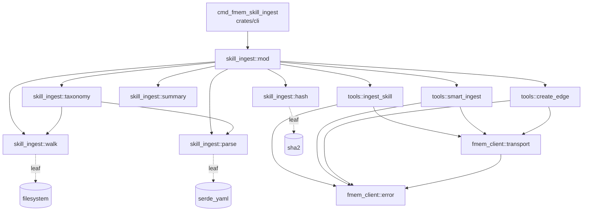

# fmem-skill-ingest DSM Analysis

> Phase 2 of blueprint. Since no implementation exists yet, this is a *prospective* DSM — dependency direction for the new code with no cycles.
> Updated 2026-04-16: added `skill_ingest::taxonomy` + `fmem_client::tools::smart_ingest` for the new taxonomy pre-pass.

## Module inventory (proposed)

| Module | Crate | Responsibility |
|---|---|---|
| `skill_ingest::walk` | `forge-ingest` | Walk filesystem, yield (path, relative-category, SKILL.md bytes) |
| `skill_ingest::parse` | `forge-ingest` | YAML frontmatter + markdown body → typed `Skill` struct (includes `tags` + `category`) |
| `skill_ingest::hash` | `forge-ingest` | `content_hash = sha256(frontmatter ‖ body ‖ supplementary)`; also `tag_hash = sha256(tag_name ‖ parent_tags)` |
| `skill_ingest::taxonomy` | `forge-ingest` | Walk top-level dirs; parse optional `tag-hierarchy.yaml`; emit ordered list of tags + `PARENT_TAG` edges |
| `skill_ingest::summary` | `forge-ingest` | Per-run counters split into taxonomy + skill buckets; diff formatter |
| `skill_ingest::mod` | `forge-ingest` | Three-phase orchestration: taxonomy → skill entities → inter-skill edges |
| `fmem_client::transport` | `forge-fmem-client` | stdio/HTTP JSON-RPC framing |
| `fmem_client::tools::ingest_skill` | `forge-fmem-client` | Typed wrapper over the `ingest_skill` MCP tool |
| `fmem_client::tools::smart_ingest` | `forge-fmem-client` | Typed wrapper over fmem's generic `smart_ingest` (used for `entity_type="tag"` here; reusable for future admin paths) |
| `fmem_client::tools::create_edge` | `forge-fmem-client` | Typed wrapper for `PARENT_TAG` / `REQUIRES` / `RELATED_TO` edge creation |
| `fmem_client::error` | `forge-fmem-client` | Typed error enum |
| `cmd_fmem_skill_ingest` | `forge-cli` (binary) | `clap` handler + MCP tool registration |

## Dependency direction

Two layers:

1. **Orchestration** (`cmd_fmem_skill_ingest` → `skill_ingest::mod`)
2. **Leaves** (`walk`, `parse`, `hash`, `taxonomy`, `summary`, `fmem_client::*`)

`skill_ingest::taxonomy` is a thin composition over `walk` and `parse` — it reuses the filesystem walker to enumerate top-level dirs and the YAML parser to handle `tag-hierarchy.yaml`. No back-edges. Each leaf can be unit-tested without the others.

## Fan-in / fan-out targets

| Module | Fan-in (target) | Fan-out (target) |
|---|---|---|
| `skill_ingest::mod` | 1 (cli only) | 9 (walk, parse, hash, taxonomy, summary, 3 client tools, transport) |
| `skill_ingest::walk` | 2 (mod, taxonomy) | 0 (leaf) |
| `skill_ingest::parse` | 2 (mod, taxonomy) | 0 (leaf) |
| `skill_ingest::hash` | 1 (mod) | 0 (leaf) |
| `skill_ingest::taxonomy` | 1 (mod) | 2 (walk, parse) |
| `fmem_client::tools::ingest_skill` | ≥1 now (mod); grows with future admin commands | 2 (transport, error) |
| `fmem_client::tools::smart_ingest` | ≥2 now (mod for taxonomy + lazy per-skill) | 2 (transport, error) |
| `fmem_client::tools::create_edge` | ≥1 (mod) | 2 (transport, error) |
| `fmem_client::transport` | 3 (each tool) | 0 (leaf) |

A high-fan-out orchestrator coordinating zero-fan-out leaves is the shape DSM analysis rewards — it keeps correlated failures to the orchestrator where they are easy to observe and test.

## Cycle check

No cycles by construction. Enforcement in CI via `frg dsm --enforce` once the modules exist.

## Coupling concerns

- **`skill_ingest::parse` ↔ fmem's skill schema.** The parser emits a shape that `fmem_client::tools::ingest_skill` passes through to fmem. If fmem changes its `SKILL_PROPERTIES_SCHEMA`, the parser must keep in sync. Mitigation: keep a small mirrored copy of the schema in `fmem_client::tools::ingest_skill` used for `--dry-run` validation, and assert its version string at build time against a constant pulled from fmem's schema file via `include_str!` (if the fmem workspace is available at build time) or vendored (if it is not). Decide at implementation time; either way, the drift is *visible* rather than silent.
- **`skill_ingest::taxonomy` ↔ fmem's tag semantics.** The taxonomy pre-pass assumes fmem treats `entity_type="tag"` as scope-Global and idempotent on name collision. Both are spec commitments in `skills-layer-design.md`; assert them via a small probe call in `initialize` or document the fmem version range this feature requires.
- **`fmem_client::transport` ↔ MCP protocol evolution.** MCP is a moving target. Pin a protocol version in the `initialize` handshake and fail loud if the server advertises a breaking change.

## Extraction opportunity (deferred)

Once a second fmem admin command lands (`frg fmem-invoke-skill` or similar), consider whether `fmem_client::tools` should promote shared types out of `forge-ingest` into a `forge-fmem-types` crate. Not needed for this feature.
