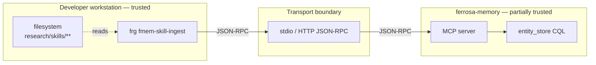

# fmem-skill-ingest Threat Model

> Phase 3 of blueprint. STRIDE over the feature's attack surface. Scope: the new subcommand, its parser, its MCP client, and the path it opens between the developer filesystem and the ferrosa-memory store.
> Updated 2026-04-16: added `tag-hierarchy.yaml` parsing threats and partial-taxonomy state risks.

## Trust boundaries

### Boundaries worth naming

- **B1 — Filesystem → Parser.** Skill markdown is authored by humans and occasionally by agents. Content is semi-trusted but readable by anyone with repo write access.
- **B2 — Parser → MCP client.** Internal; same process, same trust.
- **B3 — MCP client → fmem server.** Process boundary. Both sides run as the same user, but stdio framing bugs or a compromised fmem binary become concerns here.
- **B4 — fmem server → entity_store.** Out of scope (owned by fmem's own threat model).

## STRIDE

Risk scoring: Likelihood × Impact, each 1–5. Risk = L × I. Mitigation priority: ≥15 addressed before merge, 9–14 addressed in sprint, <9 documented and watched.

### Spoofing

| ID | Threat | L | I | R | Mitigation |
|---|---|---|---|---|---|
| S1 | Malicious `fmem --mcp` binary on PATH intercepts ingest | 2 | 4 | 8 | Resolve server via explicit `--server` path or configured absolute path; log the resolved executable hash at startup |
| S2 | HTTP mode without TLS allows MITM if ever run across network | 2 | 4 | 8 | Require `https://` or explicit `--insecure` flag; default to stdio |

### Tampering

| ID | Threat | L | I | R | Mitigation |
|---|---|---|---|---|---|
| T1 | Crafted `SKILL.md` frontmatter with YAML anchor/alias bomb (billion laughs) exhausts memory | 3 | 4 | 12 | Use `serde_yaml` with the default safe loader (no anchors → refs resolved lazily or disabled); cap frontmatter size at 64 KiB |
| T2 | Malicious frontmatter sets `name` to a reserved/privileged skill slug, overwriting an existing skill | 2 | 4 | 8 | Treat names as opaque strings; disallow `name` containing path separators or starting with `.`; surface *collision* via fmem `action: Updated` — operator sees the diff |
| T3 | Path in `supplementary-files` escapes the skill directory via `..` | 3 | 4 | 12 | Canonicalize each supplementary path, assert it starts with the skill dir's canonical path; refuse otherwise |
| T4 | Symlinks under `skills/` point at sensitive files outside the tree (private keys, etc.) | 3 | 5 | 15 | Use `walkdir` with `follow_links(false)`; if a symlink is encountered, record a warning and skip |
| T5 | `tag-hierarchy.yaml` YAML-bomb (billion laughs) exhausts memory during taxonomy pre-pass | 3 | 4 | 12 | Same mitigation as T1 — safe loader + 64 KiB size cap for the hierarchy file |
| T6 | `tag-hierarchy.yaml` declares a cycle (`a PARENT_TAG b`, `b PARENT_TAG a`) causing infinite traversal or broken fmem graph | 3 | 3 | 9 | Pre-validate the hierarchy with a DFS cycle check before any fmem call; exit 3 if a cycle is found, naming both nodes |
| T7 | `tag-hierarchy.yaml` references tag names containing path separators or control characters | 2 | 3 | 6 | Validate tag names against `^[a-z0-9][a-z0-9_-]*$`; reject otherwise with named offset |
| T8 | Malicious frontmatter `tags:` list contains an overly long or non-UTF-8 entry that blows up fmem's tag column | 2 | 3 | 6 | Cap tag string length at 64 chars; require ASCII + `[a-z0-9_-]`; reject with named offset |

### Repudiation

| ID | Threat | L | I | R | Mitigation |
|---|---|---|---|---|---|
| R1 | "I don't know which run overwrote skill X" — updates leave no audit trail | 3 | 2 | 6 | Log per-skill action (created/updated/skipped) with previous and new `content_hash`; `--verbose` mode includes truncated diff |
| R2 | CI runs the ingest; developer later can't tell CI vs local run | 2 | 2 | 4 | Emit `actor` field (from `USER`/`GITHUB_ACTOR`) in the per-skill log line |

### Information Disclosure

| ID | Threat | L | I | R | Mitigation |
|---|---|---|---|---|---|
| I1 | Secrets accidentally embedded in a `SKILL.md` get ingested and retrievable from fmem | 4 | 4 | 16 | Run `crates/secret-scan` as a pre-ingest gate; refuse to ingest any skill whose body matches; emit a clear error naming the file and offset |
| I2 | Error messages echo raw frontmatter content into logs, possibly containing secrets | 3 | 3 | 9 | Error paths never echo raw frontmatter — only the path and a short reason; secret-scan runs before any log emits body content |
| I3 | MCP server process stdout/stderr leaks tenant/session IDs into ambient shell history | 2 | 2 | 4 | Match existing `frg ingest` convention: session/tenant in stderr, structured JSON on stdout; already covered |

### Denial of Service

| ID | Threat | L | I | R | Mitigation |
|---|---|---|---|---|---|
| D1 | Enormous `SKILL.md` (e.g. accidental log file) causes unbounded parse allocation | 3 | 3 | 9 | Cap per-file read at 2 MiB; skip + warn above |
| D2 | Pathological glob `--filter "*"` against a deeply nested `--root` hangs on symlink loops | 2 | 3 | 6 | `follow_links(false)` + depth cap of 10 on the walker |
| D3 | Flood of new skills overruns fmem's write capacity | 2 | 3 | 6 | Bound in-flight requests to 1 at a time for v1; concurrent path is a future work item |
| D4 | Huge `tag-hierarchy.yaml` with thousands of PARENT_TAG edges overwhelms fmem | 2 | 3 | 6 | Cap hierarchy file at 64 KiB; cap edge count at 1000; reject above with named count |

### Elevation of Privilege

| ID | Threat | L | I | R | Mitigation |
|---|---|---|---|---|---|
| E1 | JSON-RPC response injection — crafted response tricks client into executing a different tool | 2 | 4 | 8 | Match responses to requests by `id` strictly; reject mismatched ids; do not re-dispatch by method string |
| E2 | Hash collision lets an attacker convince forge a changed skill is unchanged (skipping update) | 1 | 3 | 3 | SHA-256 preimage resistance covers this; no additional action |

## Mitigation backlog

Priority ≥15 — blocker:
- **T4** (symlink escape) → walker hardening
- **I1** (secrets in body) → secret-scan gate

Priority 9–14 — sprint:
- **T1** (YAML bomb, SKILL.md) → size cap + safe loader
- **T3** (supplementary path traversal) → canonicalization
- **T5** (YAML bomb, tag-hierarchy.yaml) → size cap + safe loader
- **T6** (tag hierarchy cycle) → pre-ingest DFS cycle detection
- **I2** (log leakage) → error hygiene
- **D1** (large file) → file-size cap

Priority <9 — documented, not blocking for v1:
- S1, S2, T2, T7, T8, R1, R2, I3, D2, D3, D4, E1, E2

Each mitigation becomes a work item in the project plan (Phase 6) with a pointer back to its STRIDE id.

## Assumptions

- The developer workstation is trusted; any adversary with write access to `research/skills/` could already do worse.
- fmem enforces its own authorization (tenant/session isolation) — forge does not re-check.
- The content of `SKILL.md` files is reviewed by humans via PR before merging; malicious content is primarily an accidental-rather-than-targeted risk.
