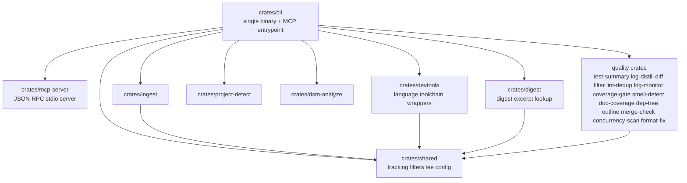

# Forge Overview

> Last updated: 2026-04-07
> Status: Draft

## Overview

`forge` is a Rust workspace that packages token-saving developer tooling into a single CLI binary and an MCP server. The core product is the Forge runtime, shipped via the `frg` executable defined in [`crates/cli`](../crates/cli/Cargo.toml), which exposes direct subcommands, MCP tools, analytics-backed proxy execution, Claude hook integration, and knowledge-graph ingestion workflows.

The workspace is organized as a thin orchestration layer over focused library crates. Most crates implement one capability family, while the CLI crate handles argument parsing, MCP registration, config lookup, and output dispatch. This keeps features independently testable while preserving a single-binary distribution model.

## Workspace Shape



## Runtime Modes

### 1. Direct CLI

The binary runs named subcommands such as `test-summary`, `digest`, `dsm`, `ingest`, `ingest-url`, `ingest-paper`, `run`, `init`, and `discover`.

### 2. MCP Server

`frg --mcp` starts a JSON-RPC stdio server backed by [`crates/mcp-server`](../crates/mcp-server/src/lib.rs). The CLI crate registers tool definitions and handlers, while the MCP server filters visible tools using tier metadata and detected project stacks.

### 3. Hook Delegator

Claude hook integration resolves to a canonical delegator command:

```text
frg hook 2>/dev/null || true
```

The hook path keeps Claude settings stable while runtime logic decides which filter to apply.

### 4. Knowledge Ingestion

The ingestion pipeline turns codebases, web pages, and papers into structured entities and edges for ferrosa-memory or JSON output. This makes architectural context reusable across sessions.

## Key Constraints

- Single Cargo workspace under [`Cargo.toml`](../Cargo.toml)
- One distributed executable: `frg`
- Library crates stay focused and reusable
- MCP tool visibility is tiered to reduce token overhead
- CLI flows prefer structured JSON output over raw shell output
